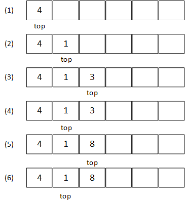
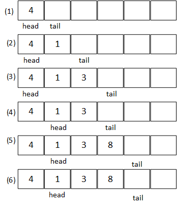

## Chapter 10 基本数据结构

### 10.1 栈和队列

#### 10.1-1
   

#### 10.1-2
建立两个栈分别从数组首部和尾部向内扩展，当两个栈顶指针相等时即代表已满。         
[MyDoubleStack](code/MyDoubleStack.java)  

#### 10.1-3       
   

#### 10.1-4   
[MyQueue](code/MyQueue.java)

#### 10.1-5
头指针和尾指针处均可出入队列     
[MyDeQueue](code/MyDeQueue.java)

#### 10.1-6     
