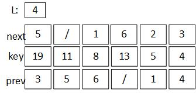
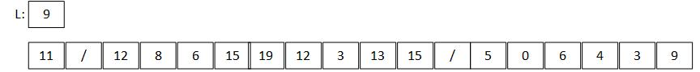

## Chapter 10 基本数据结构

### 10.1 栈和队列

#### 10.1-1
   

#### 10.1-2
建立两个栈分别从数组首部和尾部向内扩展，当两个栈顶指针相等时即代表已满。         
[MyDoubleStack](code/MyDoubleStack.java)  

#### 10.1-3       
   

#### 10.1-4   
[MyQueue](code/MyQueue.java)

#### 10.1-5
头指针和尾指针处均可出入队列     
[MyDeQueue](code/MyDeQueue.java)

#### 10.1-6     
[StackToQueue](code/StackToQueue.java)

**入队时间：**        
直接进栈1即可，时间O(1)     
**出队时间：**        
由于出队过程发生在栈2，而入队过程在栈1，元素存在从栈1到栈2的移动过程，所以时间O(n)      

#### 10.1-7     
[QueueToStack](code/QueueToStack.java)      
**入栈时间：**        
直接在有元素的队列入队即可，时间O(1)     
**出栈时间：**     
需要将有元素的队列前length - 1个元素移动到空队列中，然后出最后一个元素，时间O(n)        

### 10.2 链表      

#### 10.2-1       
**Insert：**  
链式结构，头插法可在O(1)时间内完成          
**DELETE：**       
若删除第一个元素则可以，其他特定元素则需要遍历链表

#### 10.2-2      
单链表头插法形成的顺序是与输入相反的，因此结果与栈结构相同      
[SingalListStack](code/SingalListStack.java)        

#### 10.2-3   
单链表尾插法形成顺序与输入相同，从头到为为输入顺序，需要一个变量保存尾结点位置           
[SingalListQueue](code/SingalListQueue.java)    

#### 10.2-4        
将关键字赋给nil,因此在遍历的过程中，要么发现存在关键字，返回那个元素，要么返回nil     

    LIST-SEARCH(L,k)
      L.nil.key = k
      ptr = L.nil.next
      while ptr.key != k
        ptr = ptr.next
      return ptr

#### 10.2-5      
[SingalCircleList](code/SingalCircleList.java)

#### 10.2-6        
用循环链表 ，可以找到头结点和尾结点，交换指针即可     

#### 10.2-7     
[SingalList reverse](code/SingalList.java)

#### 10.2-8  
异或：C = A ⊕ B , A = C ⊕ B , B = A ⊕ C      

    //结点信息
    node{key np}
    //形成的链表 , 
    //nil.np = nil.next , nil.prev = nil.np XOR nil.np      
    List{
        tail,head
        Node nil
        nil.np = 0
        head = tail =  nil.np

        insert(Node n)
          n.np = nil.np XOR &nil
          [nil.np].np = &n XOR &nil
          nil.np = nil.np XOR nil.np XOR &n

        search(k)
          temp = nil.np
          prev = &nil
          while [temp].key != k
            temp = [temp].np XOR prev
            prev = temp
          return temp
        
        reverse()
          nil.np = nil.np XOR nil.np
    }

### 10.3 指针和对象的实现   

#### 10。3-1       
**多数组表现形式：**      

**单数组表现形式：**     
       

#### 10.3-2        
    ; 存储数据用的数组         
    arr[length]      
    ; 假设同构对象结构：key , next , prev  
    free = 0 
    ALLOCATE-OBJECT()
      if free == -1
        error "out of space"
      else 
        x = free
        free = arr[free + 1]
      return x
    
    FREE-OBJECT(x)
      arr[x+1] = free
      free = x

#### 10.3-3      
不用找之前的空间，分配当前头指针指向的空间即可 ，分配出去后便可以重置    

#### 10.3-4      
    ;分配元素，直接分配即可  
    ; top : 当前自由表开始位置  
    ALLOCATE-OBJECT()
      x = top
      top ++;
      return x

    ; 释放元素 ，如果恰好在自由表的前面，则直接释放否则，将自由表前面空间的数据移动到释放的位置，然后释放自由表前面的空间     
    FREE-OBJECT(x)
      [x] = [top--]
      top--

#### 10.3-5     
    ; L , F 代表当前表的开头结点序号  
    ; 为满足紧凑性 0 <= L < n , n <= F < m   
    COMPACTIFY-LIST(L,F)    
      while L != nil
        ;找到一个不在范围的 L   
        while L < n && L != nil
          L = next[L]
        ;找到一个不在范围的 F  
        while F >= n && F != nil
          F = next[F]
        if L == nil || F == nil
          break
        ; 交换双方的数据，并更改对应元素的指针  
        key[F] = key[L]
        next[prev[F]] = L
        prev[next[F]] = L
        next[prev[L]] = F
        prev[next[L]] = F
        exchange next[F] and next[L]
        exchange prev[F] and prev[L]  
        exchange L and F
        L = next[L]
        F = next[F]

### 10.4 有根树   

#### 10.4-1           
---------- 18 --------------          
------12--------10-----------       
---7-----4----2-----9--------    
-------5---------------------       
15  ,    14            

#### 10.4-2        
    print(root)
      while root != nil
        打印 root.key
        print(root.left)
        print(root.right)

#### 10.4-3             
    print(root)
      InitStack(S)
      S.push(root)
      while !S.empty()
        n = S.pop()
        if n.left != nil  
          S.push(n.left)
        if n.right != nil
          S.push(n.right)
        打印 n.key

#### 10.4-4           
    print(root)
      while root != nil
        打印 root.key
        print(root.left-child)
        print(root.right-sibling)           

#### [10.4-5 printTree](code/BiTree.java) 
* 需要存有父结点地址的属性        
* 根据当前访问结点cur和之前访问结点prev关系来遍历      
  1. prev 为 cur 的父结点，表明正好第一次访问到当前结点，则继续向左访问即可          
  2. prev 为 cur 的左孩子，表明左子树已经访问完毕，接下来访问右子树   
  3. prev 为 cur 的右孩子，表明左右子树都访问完毕，回到父结点处    

#### 10.4-6       
    Node 
      key   
      left-child,right-sibling
      bool  // true : 有有兄弟，false : 指向父结点    
    
    SEARCH(root)  
      prev = root
      cur = root.left-child
      next = null
      while cur != null
        if cur == prev.left-child
           next = cur.left-child
           if nex == null 
             next = cur.right-sibling
        else 
           next = cur.right-sibling
        prev = cur
        if prev.bool = false
          cur = next.right-sibling
        else
          cur = next     
      
### 思考题       

#### 10-1               
 -|未排序的单链表|已排序的单链表|未排序的双向链表|已排序的双向链表
 -|-|-|-|-      
 SEARCH(L,k)| O(n)|O(n)|O(n)|O(n)       
 INSERT(L,x)|O(1)|O(1)|O(1)|O(1)
 DELETE(L,x)|O(n)|O(n)|O(1)|O(1)  
 SUCCESSOR(L,x)|O(n)|O(1)|O(n)|O(1)       
 PREDECESSOR(L,x)|O(n)|O(n)|O(n)|O(1) 
 MINMUM(L)|O(n)|↑O(1) or ↓O(n)|O(n)|O(1)        
 MAXMUN(L)|O(n)|↑O(n) or ↓O(1)|O(n)|O(1)           

 #### 10-2        
 **a. 已排序的链表**        
     
    MAKE_HEAP(L)  //O(1)
      return make-list(L)
    INSERT(L,k)   //O(n)
      insert-list(L,k) 
    MINMUM(L)     //O(1)
      return L.next    
    EXTRACT-MIN(L)  //O(1)
      temp = L.next
      L = L.next
      return temp
    UNION(L1,L2)  
      //case 1:      //O(n^2) 
      while(L2 != null)
        if search(L1,L2.key) == false
          insert-list(L1,L2)
          L2 = L2.next
      //case 2 : like megre sort  O(n)
        merge(L1,L2)

**b. 未排序的链表**       

    MAKE_HEAP(L)  //O(1)
      return make-list(L)
    INSERT(L,k)   //O(1)
      insert-list(L,k) 
    MINMUM(L)     //O(n)
      temp = L
      min = temp.key
      while temp != null
        if min > temp.key
          min = temp.key
        temp = temp.next    
    EXTRACT-MIN(L)  //O(n)
      temp = L
      front = temp
      min = temp
      while temp != null
        if min.key > temp.key
          min = temp
          front = min
      front.next = min.next
      return min
    UNION(L1,L2)   //O(n)
      temp = L1
        while temp.next != null
          temp = temp.next
      temp.next = L2

**c.Lists are unsorted, and dynamic sets to be merged are disjoint.**          
与上面未排序类似         

    UNION(L1,L2)   //O(n)
      temp = L1
        while temp.next != null
          temp = temp.next
      temp.next = L2

#### 10-3        
