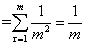
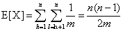

## Chapter 11 散列表         

### 11.1 直接寻址表     
* 优点：插入，查找，删除都在O(1)时间           
* 缺点：        
  1. 若全域|U|很大，则存储不太实际；          
  2. 实际存储的关键字数目相对于U来说很小          

#### 11.1-1          
如果存在最大元素，则一定位于直接寻址表T所存放元素的最后一个，所以从后向前遍历，查找第一个不为空的位置即可。        
最坏情况为T只有第一个位置有元素，时间为O(m)          

#### 11.1-2   
    //假设关键字 key ∈ {0,1,...,m-1}      
    //初始化长度为m的数组,每一位置0 ，代表没有对应关键字    
    arr[m] = {0}
    DIRECT-ADDRESS_SEARCH(T,k)
      if T[k] == 1
        return k
      else return -1
    DIRECT-ADDRESS_INSERT(T,k)
      T[k] = 1
    DIRECT-ADDRESS_DELETE(T,k)
      T[k] = 0

#### 11.1-3            
插入时若有相同关键字，替换为新的指针即可

#### 11.1-4         
在栈S中存储元素，然后在大数组中对应key位置赋栈指针值        
    
    A[];
    S[],top = -1
    INSERT(x)
      top++
      S[top] = x
      A[x.key] = top
    SEARCH(x)
      if 0 <= A[x.key] <= top
        return S[A[x.key]]
    DELETE(x)
      if 0 <= A[x.key] <= top
        //删除导致空洞，和栈顶元素互换，然后出栈
        A[S[top].key] = A[x.key]  
        A[x.key] = -1
        exchange S[top] and S[A[x.key]]
        top--

### 11.2 散列表             
利用散列函数将全域U映射到一个小的范围内        
h: U → {0,1,...,m-1}            
↓ 鸽巢原理    
冲突：不同的关键字映射到同一个位置     
解决：     
1. 链接法：在同一个位置的元素放到同一个链表中         
2. 开放寻址法：           

#### 11.2-1             
**生日悖论**             
* 设 bh = r 表示关键字i落入到r位置，r ∈ {1, 2, ... , m} , 则 Pr{bh=r}=1/m                      
* 对于 1 <= h < l <= n , h和l同时落入r位置 ， P{bh=r且bl=r}=P{bh=r}P{bl=r} = 1/m^2             
* P{h , l冲突}            
- 令 Xhl = {h,l冲突} = 1 | 0 ，E[Xhl] = P{Xhl=1} = 1/m    
-                   

#### 11.2-2              
1. 计算散列值   

关键字|5|28|19|15|20|33|12|17|10           
-|-|-|-|-|-|-|-|-|-|-         
h(k)=kmod9|5|1|1|6|2|6|3|8|1               

2. 插入散列表               

散列值|存储数字|-|-|-|   
-|-|-|- |-      
0|null    
1|28|19|10|null
2|20|null
3|12|null
4|null
5|null
6|15|33|null
7|null
8|17|null

#### 11.2-3
**成功的查找：**          
设每个链平均有α = n/m个元素   
T(n) = 1/α *(1 + 2 + ... + α) = (α + 1)/2         
O(1 + (α + 1)/2)                
**不成功的查找**         
同未排序的散列表，O(1 + (α + 1)/2)，当链表α较大时，可减小查找的数据量                                
**插入：**        
增加了插入时间           
**删除：** 没有影响             

#### 11.2-4          
需要双链表，因为某个关键字的槽位可能位于链表的中间，需要从中间删除    
#### 11.2-5        
因为|U|>mn , 则必然有一个槽的链表长度大于n,当遍历该链表时，时间为O(n)            

#### 11.2-6             

