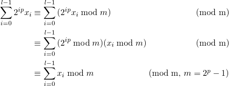

## Chapter 11 散列表         

### 11.1 直接寻址表     
* 优点：插入，查找，删除都在O(1)时间           
* 缺点：        
  1. 若全域|U|很大，则存储不太实际；          
  2. 实际存储的关键字数目相对于U来说很小          

#### 11.1-1          
如果存在最大元素，则一定位于直接寻址表T所存放元素的最后一个，所以从后向前遍历，查找第一个不为空的位置即可。        
最坏情况为T只有第一个位置有元素，时间为O(m)          

#### 11.1-2   
    //假设关键字 key ∈ {0,1,...,m-1}      
    //初始化长度为m的数组,每一位置0 ，代表没有对应关键字    
    arr[m] = {0}
    DIRECT-ADDRESS_SEARCH(T,k)
      if T[k] == 1
        return k
      else return -1
    DIRECT-ADDRESS_INSERT(T,k)
      T[k] = 1
    DIRECT-ADDRESS_DELETE(T,k)
      T[k] = 0

#### 11.1-3            
插入时若有相同关键字，替换为新的指针即可

#### 11.1-4         
在栈S中存储元素，然后在大数组中对应key位置赋栈指针值        
    
    A[];
    S[],top = -1
    INSERT(x)
      top++
      S[top] = x
      A[x.key] = top
    SEARCH(x)
      if 0 <= A[x.key] <= top
        return S[A[x.key]]
    DELETE(x)
      if 0 <= A[x.key] <= top
        //删除导致空洞，和栈顶元素互换，然后出栈
        A[S[top].key] = A[x.key]  
        A[x.key] = -1
        exchange S[top] and S[A[x.key]]
        top--

### 11.2 散列表             
利用散列函数将全域U映射到一个小的范围内        
h: U → {0,1,...,m-1}            
↓ 鸽巢原理    
冲突：不同的关键字映射到同一个位置     
解决：     
1. 链接法：在同一个位置的元素放到同一个链表中         
2. 开放寻址法：           

#### 11.2-1             
**生日悖论**             
* 设 bh = r 表示关键字i落入到r位置，r ∈ {1, 2, ... , m} , 则 Pr{bh=r}=1/m                      
* 对于 1 <= h < l <= n , h和l同时落入r位置 ， P{bh=r且bl=r}=P{bh=r}P{bl=r} = 1/m^2             
* P{h , l冲突}            
- 令 Xhl = {h,l冲突} = 1 | 0 ，E[Xhl] = P{Xhl=1} = 1/m    
-                   

#### 11.2-2              
1. 计算散列值   

关键字|5|28|19|15|20|33|12|17|10           
-|-|-|-|-|-|-|-|-|-                  
h(k)=kmod9|5|1|1|6|2|6|3|8|1                

2. 插入散列表               

散列值|存储数字|-|-|-|   
-|-|-|- |-      
0|null    
1|28|19|10|null
2|20|null
3|12|null
4|null
5|null
6|15|33|null
7|null
8|17|null

#### 11.2-3
**成功的查找：**          
设每个链平均有α = n/m个元素   
T(n) = 1/α *(1 + 2 + ... + α) = (α + 1)/2         
O(1 + (α + 1)/2)                
**不成功的查找**         
同未排序的散列表，O(1 + (α + 1)/2)，当链表α较大时，可减小查找的数据量                                
**插入：**        
增加了插入时间           
**删除：** 没有影响             

#### 11.2-4          
需要双链表，因为某个关键字的槽位可能位于链表的中间，需要从中间删除    
#### 11.2-5        
因为|U|>mn , 则必然有一个槽的链表长度大于n,当遍历该链表时，时间为O(n)            

#### 11.2-6             

### 11.3 散列函数  
0. 目标：靠近简单均匀散列。

1. 除法散列法：h(k) = k mod m , 假设平均每个槽放 n0 个元素，总共有 n 个元素，那么 m 应该是一个接近 n/n0 但又不接近2的任何次幂的素数。            
2. 乘法散列法：h(k) = floor(m * (kA mod 1)) , m一般为2的某个幂次，A 形如 s/2^w ,  0 < s < 2^w , A = (√5 - 1)/2 较好。

3. 全域散列：使用一组散列函数H，随机选择一个避免特殊关键字序列对散列性能的影响，使 h(i) = h(j) 的散列函数至多为|H|/m   

#### 11.3-1     
先计算查找的散列值，然后在对应链表中查找相应的关键字           

#### 11.3-2               
将 r 位数每个字符加起来得到和，然后和 128 取余数        

#### 11.3-3               
                      
所以不管怎么交换每位数的位置，其 mod 2^p - 1 的余数不变     
∴ y ≡ x (mod 2^p - 1)             

#### [11.3-4 MulHash](code/MulHash.java)        
KEY|VALUE      
-|-  
61|700
62|318
63|936
64|554
65|172              

#### 11.3-5           

#### 11.3-6    

### 11.4 开放寻址法  

#### [11.4-1 OpenHash](code/OpenHash.java)
**LINER PROBE:**        
key 10 :  probe 10 ,  end  
key 22 :  probe 0 ,  end        
key 31 :  probe 9 ,  end       
key 4 :  probe 4 ,  end        
key 15 :  probe 4 ,    probe 5 ,  end         
key 28 :  probe 6 ,  end        
key 17 :  probe 6 ,    probe 7 ,  end          
key 88 :  probe 0 ,    probe 1 ,  end          
key 59 :  probe 4 ,    probe 5 ,    probe 6 ,    probe 7 ,    probe 8 ,  end              

**SECOND PROBE:**                  
key 10 :  probe 10 ,  end            
key 22 :  probe 0 ,  end            
key 31 :  probe 9 ,  end         
key 4 :  probe 4 ,  end             
key 15 :  probe 4 ,    probe 8 ,  end              
key 28 :  probe 6 ,  end             
key 17 :  probe 6 ,    probe 10 ,    probe 9 ,    probe 3 ,  end            
key 88 :  probe 0 ,    probe 4 ,    probe 3 ,    probe 8 ,    probe 8 ,    probe 3 ,    probe 4 ,    probe 0 ,    probe 2 ,  end                   
key 59 :  probe 4 ,    probe 8 ,    probe 7 ,  end         

**DOUBLE PROBE:**            
key 10 :  probe 10 ,  end            
key 22 :  probe 0 ,  end               
key 31 :  probe 9 ,  end            
key 4 :  probe 4 ,  end            
key 15 :  probe 4 ,    probe 10 ,    probe 5 ,  end         
key 28 :  probe 6 ,  end              
key 17 :  probe 6 ,    probe 3 ,  end             
key 88 :  probe 0 ,    probe 9 ,    probe 7 ,  end           
key 59 :  probe 4 ,    probe 3 ,    probe 2 ,  end           

#### 11.4-2 

    HASH-DELETE(T,k)
      i = 0
      repeat
        j = h(k,i)
        if T[j] == k
          T[j] = DELETE  // 做一个删除标记，不能删除，否则无法查找到因为冲突而位于下一个位置的关键字
          return j
        i = i + 1
      until i == m || T[j] == NIL
      return NIL
    
    HASH-INSERT(T,k)
      i = 0
      repeat
        j = h(k,i)
        if T[j] == NIL || T[j] == DELETE  // 在DELETE处可添加  
          T[j] = k
          return j
        i = i+ 1

#### 11.4-3          
**α = 3/4**  
* 不成功：1 / (1 - 3/4) = 4         
- 成功： 1/3/4 * ln (1 / (1 - 3/4)) = 4/3 * ln4 ≈ 1.848        

**α = 7/8**            
* 不成功：1 / (1 - 7/8) = 8        
- 成功：8/7 * ln8 ≈ 2.3765           

#### 11.4-4         

#### 11.4-5      
α = 0.717   
1/(1 - α) = 2/α * ln(1/(1 - α))     

### 11.5 完全散列 

#### 11.5-1 
首先每一对发生冲突的概率为 1/m , 总共有C(n,2)对，    
Pr{发生冲突} = 1/m * C(n,2) = n(n-1)/2m             
A = "不发生冲突"          

### 思考题

#### 11-1 
**a.** 设 Xi = "第 i 次插入探查次数" , Ak = "第 k 次探查且是一个被占用的槽" . Pr{Xi >= k} = |A1 ∩ A2 ∩ ... ∩ Ak-1| , 在第 i 次插入前，已经有 i - 1 个数，所以：                      
                 

**b.**              

**c.** 对于 i = 1 , 2 , ... , n 每一次都有可能出现最大值，所以出现最大值概率的上界是这些情况的并集 ，因此：            
             

**d.**  x = 1 , 2 , ... , n , 由于 ∑Pr{x} = 1 ，所以：   
             

#### 11-2          
**a.** 首先对于一个特定的槽，散列到该槽的概率为 1/n ，不到的概率为 1 - 1/n ，是一次伯努利实验，对于 k 个关键字，每个关键字的散列过程都是独立的，因此是 k 重伯努利实验，记 X = "散列到指定槽的次数" , 则 X~B(k,1/n) , 所以 :      
       

**b.** 对于最大值，每一个槽均有可能出现，因此 Pr{X = k} = ∪Pr{Xi = k} , i = 1 , 2 , ... , n , 因此：        
              

**c.**              

**d.** 
