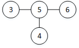

## Capter 12 二叉搜索树

### 12.1 什么是二叉搜索树

#### 12.1-1      
1. **高度为2：** 高度为 2 最多有 3 个元素，而集合有 7 个，所以不满足。 
2. **高度为3：**       
3. **高度为4：**  
4. **高度为5：**  
5. **高度为6：**  
6. **高度为7：**          

#### 12.1-2         
1. **最小堆性质：** 某结点值在以该结点作为根的子树中值最小        
   **二叉搜索树性质：** 左孩子结点及后代结点的值小于等于根结点的值，右孩子结点及后代结点的值大于根结点的值。          
2. 无法在线性时间内完成，因为没办法知道哪一个孩子有最小值，需要进行比较，因而最佳时间为 O(nlgn)               

#### 12.1-3     
[简单，栈 inOrderIterStack](code/BinSearchTree.java)      

#### 12.1-4 
更换一下中序遍历的顺序即可  

#### 12.1-5           
在建立二叉搜索树的过程中，插入的结点总要与路径上的结点进行比较，到达当前搜索树的叶结点处（该结点的位置），对于 n 个结点来说，最少的比较次数为 Ω(nlgn) , 因此最坏情况下需要 Ω(nlgn) 时间。          

### 12.2 查询二叉搜索树        

#### 12.2-1          
对于 X = < x1, x2, ..., xn > , 若 xi < xj , 则任意 x ∈ {x_j+1,..., xn} xi < x ;               
所以 e 不符合 ， 因为 347 < 621 ，而 347 > 299       

#### 12.2-2       
[minNodeRecu, maxNodeRecu](code/BinSearchTree.java)          

#### 12.2-3            
[predecessor](code/BinSearchTree.java)         

#### 12.2-4          
          
如图所示，根节点为 3 ， 查找 6 ， A = {4} , B = {3,5,6} , C = {}        
存在 a = 4 , b = 3 , 使得 a > b ;           

#### 12.2-5           
**证明：** 当前结点为 n ，左孩子为 l , 右孩子为 r , 后继为 c , 前驱为 p ;则 p.k <= n.k <= c.k     
假设后继 c 存在左孩子 cl , 那么 cl.k <= c.k ， 可得到 n.k <= cl.k <= c.k ， 则 cl 为后继；     
前驱同理可证没有右孩子；            

#### 12.2-6             
**证明：** x.rchild == null, 存在 y 为 x 的后继，   
考虑以 y.lchild 为根的子树，x 必然为关键字最大的结点，位于 y.lchild 的右子树上, 因为若位于左子树上，则 y.lchild.key > x.key; 其次，从 y.child 到 x 的路径上若存在一个大于 x 关键字的结点，那么该结点为 x 的后继，x 位于该结点的左子树上，与 y 为 x 后继矛盾；     
得到 y.key > x.key > y.lchild.key ;     
此外树的其它部分不存在结点 y' , 使得 y.key > y'.key > x.key;   
因此得 y 为 x 的后继。   

#### 12.2-7      
**证明：**   
1. 由于算法输出 n 个结点，得到 T(n) = Ω(n)        
2. 对于 n 个结点的二叉树，有 n - 1 条边，每条边只在查找后继和查找子树中最大结点后继中被使用，因此算法运行过程中，每条边最多使用两次，所以T(n) = O(n)        
3. T(n) = θ(n)                     

#### 12.2-8        
略

#### 12.2-9        
**证明：**               
1. case: x = y.left_child,          
   y.key > x.key, 如果存在结点 y' != x, 使得 y.key > y'.key > x.key, 那么由二叉树性质，y' 位于 y 的左子树上，又由于 x 为 y 的左孩子，y' 位于 y 的左孩子 x 和 y 之间的位置，而该位置不存在，那么 y' 要么与 x 重合, 要么与 y 重合，因此 y' 不存在；所以 y 为大于 x 关键字的最小结点；          
2. 同理可证；    

### 12.3 插入和删除          

#### 12.3-1           
[insertRecur](code/BinSearchTree.java)          

#### 12.3-2  
在搜索过程中，需要检查当前结点是否和关键字相等，插入时只需要和祖先结点关键字比较；          

#### 12.3-3    
1. 每次插入的时间为 log(h) 平均时间为 T(n) = lg1 + lg2 + ... + lg(n) = O(nlgn) , 最坏时间当按顺序插入时， T(n) = O(n^2)           
2. 中序遍历的时间为T(n) = O(n)        
3. 因此该方法排序时间：O(nlgn) ，最坏时间 O(n^2)               

#### 12.3-4       
