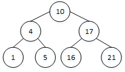
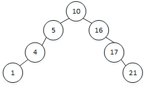
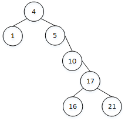
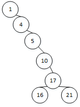
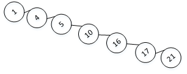

## Capter 12 二叉搜索树

### 12.1 什么是二叉搜索树

#### 12.1-1      
1. **高度为2：** 高度为 2 最多有 3 个元素，而集合有 7 个，所以不满足。 
2. **高度为3：**       
3. **高度为4：**  
4. **高度为5：**  
5. **高度为6：**  
6. **高度为7：**          

#### 12.1-2         
1. **最小堆性质：** 某结点值在以该结点作为根的子树中值最小        
   **二叉搜索树性质：** 左孩子结点及后代结点的值小于等于根结点的值，右孩子结点及后代结点的值大于根结点的值。          
2. 无法在线性时间内完成，因为没办法知道哪一个孩子有最小值，需要进行比较，因而最佳时间为 O(nlgn)               

#### 12.1-3           

#### 12.1-4 
更换一下中序遍历的顺序即可