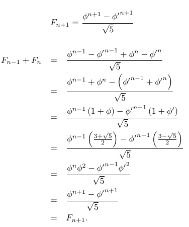

## Chapter 3 函数的增长

### 3-1 渐进记号

#### 3.1-1

证明：        
因为 max(f(n),g(n)) = { [ f(n) f(n)>=g(n) ] ∨ [ g(n) f(n) < g(n) ] }  
f(n) <= f(n) + g(n)          
g(n) <= f(n) + g(n)       
max(f(n),g(n)) <= f(n) + g(n)            
另一方面：                    
max(f(n),g(n)) >= f(n) >= 1/2 * f(n)     
max(f(n),g(n)) >= g(n) >= 1/2 * g(n)             
2 * max(f(n),g(n)) >= f(n) + g(n)         
即： max(f(n),g(n)) >= 1/2 * [f(n) + g(n)]         
所以存在 c1 = 1/2 , c2 = 1 使得：      
c1 * [f(n) + g(n)] <= max(f(n),g(n)) <= c2 * [f(n) + g(n)]      
所以 max(f(n),g(n)) = Θ(f(n)+g(n))  

#### 3.1-2

证明：
假设 c1n^b <= (n+a)^b <= c2n^b  
ln(c1n^b) <= bln(n+a) <= ln(c2n^b)  
lnc1+blnn <= bln(n+a) <= lnc2+blnn  
c1 <= (1+(a/n)^b) <=c2  
不妨取 n0 = 1 , 则存在 c1 <= 1 + a^b , c2 >= 1 + a^b      
使得当 n > n0 , 有 (n+a)^b = Θ(n^b)  

#### 3.1-3

给予运行时间的下限，并不能有效说明算法的性能，运行时间有可能更多，从而产生困扰。

#### 3.1-4
1. 2^(n+1) = Ο(2^n)  
   即 2^(n+1) <= c*2^n  
   c >= 2  

2. 2^(2n) = O(2^n)  
   即 2^(2n) <= c*2^n  
   c >= 2^n  
   2^n 没有上界 不存在满足条件的c

#### 3.1-5
证明：  
f(n) = O(g(n)) -> 存在 c1 n1, 当n >= n1时, f(n) <= c1g(n)  
f(n) = Ω(g(n)) -> 存在 c2 n2, 当n >= n2时, f(n) >= c2g(n)  
取 n0 = max(n1,n2) 则：  
当 n>=n0 时 ，
c2g(n) <= f(n) <= c1g(n)  
即 f(n) = Θ(n)

#### 3.1-6
同定理 3.1  

#### 3.1-7
证明：  
假设 f(n) =  o(g(n)) ∩ ω(g(n))
f(n) = o(g(n)) -> 任意 c1,n1 >0 when n>=n1,f(n) < c1g(n)  
f(n) = ω(g(n)) -> 任意 c2,n2 >0 when n>=n2,f(n) > c2g(n)  
任意c1 c2 >0 -> c1 = c2  
∴ o(g(n)) ∩  ω(g(n)) ＝ Φ

#### 3.1-8
Ω(g(m,n)) = {f(m.n):存在正常量c,n0和m0,使得对所有的n>=n0,m>=m0,有cg(m,n)<=f(m,n)}  
Θ(g(m,n)) = {f(m,n):存在正常量c1,c2,m0和n0,使得对所有的n>=n0,m>=m0,有c1g(m,n) <= f(m.n) <= c2g(m,n)}

### 3.2 标准记号与常用函数

#### 3.2-1
1. f(n) + g(n) 单调递增   
   设 n1 < n2,f(n1)< f(n2) , g(n1)< g(n2)  
   f(n1)+g(n1) - (f(n1)+g(n2))  
   = f(n1)-f(n2) + g(n1)-g(n2)  
   < 0  

2. f(g(n)) 单调递增  
   设 n1 < n2,f(n1)< f(n2) , g(n1) < g(n2)
   f(g(n1))-f(g(n2)) < 0  

3. f(n) * g(n) 单调递增  
  设 n1 < n2,f(n1) < f(n2) , g(n1) < g(n2)  
  f(n1) * g(n1) - f(n2) * g(n2) < 0  

#### 3.2-2
a^(lob(c)) = a^((loa(c))/(loa(b))) = (a^(loa(c)))^(1/(loa(b))) = c^(lob(a))  
注：loa(b) 以a为底b的对数

#### 3.2-3
1. lg(n!) = lg((2πn)^0.5(n/e)^n(1+Θ(1/n)))  
  = 0.5ln(2πn) + nlg(n/e) + lg(1+Θ(1/n))  
  = Θ(nlgn)  

2. lg(n!) = Θ(nlgn) , c>0 lg(n!) = cnlgn  
   n! = e^(cnlgn)  
   lim(n!/2^n)  
   = lim(e^(cnlgn)/2^n) = lim ((e^(lgn)/2)^n)  
   = ∞  
   n! = ω(2^n)  

3. lim(n!/n^n) = lim(((2πn)^0.5(n/e)^n(1+Θ(1/n))/n^n))   
   = lim(((2πn)^0.5)/e^n) * lim(n^n/n^n) * lim((1+Θ(1/n))/n^n)  
   = 0  

#### 3.2-4 3.2-5
略

#### 3.2-6
代入方程可得

#### 3.2-7
当 i=0 , Fi = 0 ; i=1 , Fi = 1成立；  
假设当i=n 或者 n-1 时成立，当i=n+1:   

#### 3.2-8
klnk = Θ(n) -> c1n <= klnk <= c2n  
c1n/lnk <= k <= c2n/lnk  
k = Θ(n/lnn)

### 思考题
#### 3-1
a.  

    k >= d
    Σa_in^i <= cn^k
    c >= Σa_in^{i-k} = Σ(a_i/(n^{k-i}))
    c >= 1
    p(n) = Θ(n^k)

b , c , d, e同理

#### 3-2
