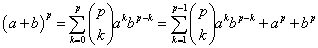
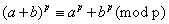
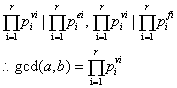

## Chapter 31 数论算法        

### 31.1 基础数论概念       

#### 31.1-1          
∵ c = a + b , 0 < b < a         
∴ 满足除法定理，b 是 c / a 的余数 ，    
∴ c mod a = b .                   

#### 31.1-2               
假设只存在有限个质数，不妨设为p1,p2,...,pk 共k个，则任意一个整数均可分解成这k个质数的乘积形式,即可以被其中一个整除 ；         
对于数 (p1p2...pk)+1 ,             
考虑 pi , 1 <= i <= k ; (p1p2...pk)+1 = (p1p2...pi-1pi+1...pk) * pi + 1 ;           
其余数为1 ≠ 0 ， 因此该数不能被pi整除，即这k个质数中任意一个都不能整除该数 ，与假设矛盾，因此存在无限多个质数。                    

#### 31.1-3                 
∵ a | b , b | c , ∴ a = pb , b = qc ; a = (pq)c  ;  a | c            
#### 31.1-4              
∵ p 是素数 ，∴ p 的约数集是 S = {1 ，p}            
对于数 k , 其约数集不妨设为Q ,         
∵ 0 < k < p , 任意 q ∈ Q , 1 ≤ q < p        
gcd(k , p) = max(S ∩ Q) = 1             

#### 31.1-5             
∵gcd(a,n) = 1 ,∴ 存在x, y ∈ Z , 使得 ax + ny = 1            
abx + nby = b            
n | ab , 存在 k ∈ Z ,  ab = kn           
knx + nby = b            
b = (kx + by) * n  (kx + by ∈ Z)                 
n | b               

#### 31.1-6                  
将等式左边由二项式定理展开得：      
因为0 < k < p , P | C(p,k) , 所以(a+b)^p 除以 p 的余数与 a^p+b^p 的余数相同             
因此           

#### 31.1-7             
**(x mod b) mod a = x mod a**                
x = pb + r , r = x mod b             
r = qa + s , s = r mod a      
s = (x mod b) mod a         
a | b , b = ka (k ∈ Z)           
x = pka + r , r = qa + s       
x = (pk + q)a + s          
s = x mod a               
(x mod b) mod a = x mod a               

**x = y(mod b) , x = y(mod a)**              
x = y(mod b)        
x = pb + r , y = qb + r          
a | b , b = ka        
x = (pk)a + r , y = (qk)a + r        
x = y(mod a)                

#### 31.1-8                  
            

#### 31.1-9 

#### 31.1-10          

#### 31.1-11 
略

#### 31.1-12      
    REMAINDER(x,a)
      remain = x
      while remail >= a
        x = x - a
    return remain 

#### 31.1-13         

### 31.2 最大公约数                 

#### 31.2-1               
令vi = min{ei,fi} , 1 <= i <= r ,       
pi^ei = pi^(ei-vi) * pi^vi , pi^fi = pi^(fi-vi) * pi^vi       
pi^vi | pi^ei , pi^vi | pi^fi    
由 n | q , n | p , 推出 n | pq ,          
         

#### 31.2-2    

a    |   b   |    d   |    x   |    y         
-|-|-|-|-                        
29   |   0   |    29   |   1   |    0          
58   |   29  |    29   |   0   |    1        
87   |   58   |   29    |  1    |   -1        
406  |   87  |    29   |   -1  |    5      
493  |   406  |   29   |   5    |   -6        
899  |   493  |   29    |  -6   |   11                  

#### 31.2-3              
∵ a+kn = k * n + a , 有除法定理 a+kn mod n = a     
∴ gcd(a+kn,n) = gcd(n,a+kn mod n) = gcd(n,a) = gcd(a,n)       

#### [31.2-4 iter_euclid](code/Euclid.java)            

#### 31.2-5        
