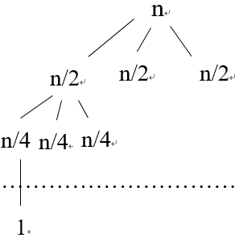
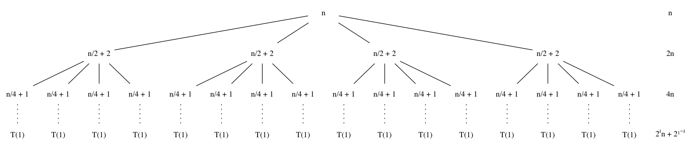
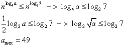

## Chapter 4  分治策略

### 4.1 最大子数组问题

#### 4.1-1
返回最大值及其所在位置的索引

#### [4.1-2](OrdMaxSubArray.java)

#### 4.1-3
80 -- 90 范围内两个算法差别相似，在大于该范围后，暴力求解算法时间上升。  

#### 4.1-4
结果为负数的时候返回空

#### [4.1-5](LineMaxSubArray.java)

### 4.2 矩阵乘法的Strassen算法

#### 4.2-1
s1 = 8 - 2 = 6   s2 = 1 + 3 = 4  s3 = 7 + 5 = 12       
s4 = 4 - 6 = -2  s5 = 1 + 5 = 6  s6 = 6 + 2 = 8     
s7 = 3 - 5 = -2  s8 = 4 + 2 = 6 s9 = 1 - 7 = -6  
s10 = 6 + 8 = 14   
p1 = 1 * 6 = 6   p2 = 4 * 2 = 8   p3 = 12 * 6 = 72   
p4 = 5 * -2 = -10  p5 = 6 * 8 = 48   p6 = -2 * 6 = -12   
p7 = -6 * 10 = -60   
C11 = 48 - 10 - 8 - 12 = 18   
C12 = 6 + 8 = 14   C21 = 72 - 10 = 62   
C22 = 48 + 6 - 72 + 84 = 66

#### [4.2-2](Strassen.java)

#### 4.2-3
修改：在分割矩阵时，如果行或列其中一个少一行（列），则在对应的位置补0即可。   
证明：   
T(n)  = 7T(n/2 + 1) + θ((n + 1)^2)  
由主方法：logb(a) = lg7   
f(n) = O(n^(lg7 - 0.8))   
T(n) = θ(n^(lg7))

#### 4.2-4
由题得：以 3 * 3 矩阵为单元计算矩阵乘法  
得递推式： T(n) = kT(n/3) + θ(n^2)  
因为：T(n) < o(n^(lg7))   
log3(9) < log3(k) < log2(7)  
k = 21  

#### 4.2-5  
方法A：T(n) = 132464T(n/68) + θ(n^2)  
log68(132464) = 2.79512849  

方法B：T(n) = 143640T(n/70) + Θ(n^2)  
log70(143640) = 2.79512269

方法C：T(n) = 155424T(n/72) + θ(n^2)  
log72(155424) = 2.79514739
均比Strassen要好

#### 4.2-6
设 A = kn * n  
B = n * kn  
1. A * B 结果为 kn * kn 的矩阵  
  每一个单元需要θ(n^lg7) ,总共k^2个，所以时间θ（k^2n^lg7)  

2. B * A 结果为 n * n 的矩阵   
   有 k 个结果相加 所以时间θ（kn^lg7)

#### 4.2-7
X = (a + b) * (c + d)  
Y = a * c   
Z = b * d   
实部：Y - Z   
虚部：X - Y - Z

### 4.3 用代入法求解递归式

#### 4.3-1
假设 T(n) <= cn^2  T(1) = c  
T(n) = c(n-1)^2 + n  
= cn^2 - 2cn + c +n  (T(1) = 1)  
= cn^2 - (2cn - c - n)  
<= cn^2  
2cn - c -n >= 0  
c >= n/(2n-1) = 1/2 (1+1/(2n-1)) = 1  
所以当 c >= 1 时，成立

#### 4.3-2
假设 T(n) ≤ clgn+1 T(1) = 1  
T(n) = clg(ceil(n/2))+1+1  
= clgn -clg2 +2  
= clgn - (clg2-1)  
<= clgn+1  
∴ clg2 -2 >= 0  
c >= 1/lg2 = 1  
当 n=1 T(1) = 1 = O(1)

#### 4.3-3
假设 T(n) >= cnlgn + 1  
T(n) = 2(cfloor(n/2)lg(floor(n/2))+1)+n  
= cnlg(floor(n/2)) + 2 + n  
= cnlgn -cn +2 + n  
= cnlgn+1 -(cn-1-n)     
≥ cnlgn+1  
∴ cn-1-n <= 0  
c <= (n+1)/n  c<=1  
当 n=1 T(1) =1 = Ω(1)  

#### 4.3-4
假设 T(n) <= cnlgn+1

#### 4.3-5
假设 c1nlgn <= T(n) <= c2nlgn  
T(n) = c2ceil(n/2)lg(ceil(n/2)) + c2floor(n/2)lg(ceil(n/2)) + c3n  
= c2nlgn -c2n + c3n  
= c2nlgn -(c2-c3)n  
<= c2nlgn  
c2-c3>=0  c2 >= c3  
T(n) = O(nlgn)  
同理 T(n) = Ω(nlgn)

#### 4.3-6
假设当 n>17 T(n) <= c(n-17)lg(n-17)   
T(n) = c(n/2)lg(n/2)+n  
= cnlgn-cn+n  
= cnlgn-(c-1)n  
<= cnlgn  
c>=1 n>17 时 T(n) = O(nlgn)  

#### 4.3-7
1. T(n) <= cn^(log3(4))   
   T(n) = 4(c(n/3)^(log3(4))) + n   
    = cn^(log3(4)) -(-n) <= cn^(log3(4))  
    -n >= 0 不成立

2. 假设 T(n) <= c1n^(log3(4)) -c2n   
T(n) = 4(c1(n/3)^(log3(4))-c2(n/3)) + n  
= c1n^(log3(4)) - c2n - (1/3c2 - 1)n  
<= c1n^(log3(4)) - c2n   
1/3c2 - 1 >= 0 ->  c2>=3  
T(1) = c1-c2 >= Θ(1)    
c1 >> c2 , c2 >= 3  T(n) = O(n^(log3(4)))   

#### 4.3-8
1. T(n) <= cn^2  
T(n) = 4c(n/2)^2 + n  
= cn^2 -(-n)  <= cn^2  
-n>=0 不成立   

2. 假设 T(n) <= c1n^2 - c2n  
T(n) = 4(c1(n/2)^2-c2n/2)+n  
= c1n^2-c2n-(c2-1)n  
<= c1n^2-c2n  
c2-1>=0  -> c2>=1  
c1 >> c2 , c2>=1  T(n)=O(n^2)

#### 4.3-9  
令 m=logn -> n=2^m   
T(2^m) = 3T(2^(m/2)) + m   
令 S(m) = T(2^m)  
 S(m) = 3(m/2) + m  
 S(m) = O(m^(log2(3)))  

 证明 ： 假设 S(m) <= c1m^(log2(3)) - c2m  
 得到 c1 >> c2 , c2>=2  

 T(n) = O(logn^(log2(3)))  

### 4.4 用递归树方法求解递归式

#### 4.4-1
  
层数：n/2^i=1  -> i = logn  每个节点： n(3/2)^i   
底层：3^(logn) = n^(log3) 个节点  
T(n) = Σ[n(3/2)^i] + Θ(n^(log3))  i=(0,...,logn-1)  
= n((3/2)^(logn-1)-1)/(3/2-1) + Θ(n^(log3))  
< 2n((3/2)^(logn)-1)) + Θ(n^(log3))  
= 2n^(log3) - 2 + Θ(n^(log3))   
= O(n^(log3))   

验证： T(n) <= cn^(log3) - dn  
T(n) = 3(c(n/2)^(log3)-dn/2) + n  
= cn^(log3) - dn - (d/2 - 1)n  
<= cn^(log3) - dn  
d/2 - 1 >=0 -> d >= 2  
c > d d>=2 T(n) = O(n^(log3))

#### 4.4-2
总共有（logn + 1) 层，每层一个节点为 (n^2/4^i)  
T(n) = n^2Σ(1/4)^i  i=(0,1,...,logn-1)  
= 4n^2/3 = O(n^2)  

checking:  T(n) <= cn^2  
T(n) = c(n/2)^2 + n^2  
= cn^2 - (3c/4 - 1)n^2 <= cn^2  
3c/4-1 >= 0  -> c>= 4/3  

#### 4.4-3
  
层数：n/2^i=1 -> i=logn   
每层代价：n2^i+2^(1-i)  
最底层：4^(logn) = n^2  
T(n) = nΣ(2^i) + 8Σ(2^i) + O(n^2)  i=(0,1,..,logn-1)  
= n^2 + 7n -8 + O(n^2)  
= O(n^2)  

checking: T(n) <= c(n-2)^2-d(n-2)  (n>=3)  
T(n) = 4(c(n/2)^2 - d(n/2)) + n  
= cn^2 - 2dn + n  
= cn^2 - dn - (d-1)n  
< cn^2 - dn  
d-1 >= 0 -->  d>=1  
c> d  T(n) = O(n^2)

#### 4.4-4
T(n) = T(n-1) +1  
T(n-1) = T(n-2) +1  
......  
T(2) = T(1) +1  
T(n) = T(1) + n-1 = O(n)  

#### 4.4-5
最长 n 层
一 n
二 (3/2)n - 1  
三 (9/4)n - 7/2
...

T(n) < nΣ(3/2)^i  (i=0,1,...,n)  
= 2n(3/2)^n  
= O(n(3/2)^n)  

#### 4.4-6
当递归树中叶节点为最短路径时，取得最小值，即(1/3)^i 为分支的路径，此时高度为log3(n)，每层代价cn，总代价：cnlog3(n)  
即 T(n) = Ω(nlgn)  

#### 4.4-7
(1) cn  
(2) [cn/2] [cn/2] [cn/2] [cn/2]    
(3) [cn/4] ... [cn/4] (16个)  
...

高度： n/2^i = 1  i=logn  
最底层： 4^(logn) = n^2   
每层代价：n*2^i  

T(n) = cnΣ2^i + O(n^2) i=(1,2,...,logn-1)   
= n^2-n+O(n^2)  
= Θ(n^2)  

checking:  
Providing T(n) <= dn^2 - en    
T(n) = 4(d(n/2)^2 - en/2)+ cn   
= dn^2 - 2en + cn  
= dn^2 - en -(e-c)n
<= dn^2-en  
d>e , e>=c T(n) = O(n^2)  
Same: T(n) = Ω(n^2)  

#### 4.4-8
(1) cn  
(2) [c(n-a)] [ca]  
(3) [c(n-2a)] [ca]  
...  

height: n-ia = 0  i=n/a  
floor cost : cn-ica  

T(n) = cn + Σ(c(n-ia)) [i=(0,1,...,n/a-1)]  
= cn + n/a*cn - caΣi  
= Θ(n^2)  

#### 4.4-9
假设 0 < 1-α <= α < 1  
(1) cn  
(2) [cαn] [c(1-α)n]  
(3) [cα^2n] [cα(1-α)n] [cα(1-α)n] [c(1-α)^2n]  
...

height:  
max α^in = 1 --> i=logα(1/n)  
min n(1-α)^i=1 --> i=log_(1-α)(1/n)  
floor cost : cn  
T(n) = cn*loga(1/n) = Θ(nlogn)

### 4.5 用主方法求解递归式

#### 4.5-1
a.   
T(n) = 2T(n/4) + 1  
loga(b) = 1/2  
f(n) = 1 = O(n^(1/2-1/2))  
T(n) = Θ(n^(1/2))   

b.
T(n) = 2T(n/4)+n^(1/2)  
f(n) = Θ(n^(1/2))  
T(n) = Θ(n^(1/2)logn)  

c.  
T(n) = 2T(n/4) + n  
f(n) = Ω(n^(1/2+1/2))   
when c=1/2  
af(n/b) = 2(n/4) = n/2 <= cf(n)  
T(n) = Θ(n)  

d.   
T(n) = 2T(n/4)+n^2  
f(n) = Ω(n^(1/2+3/2))  
when c=1/8   
af(n/b) = 2(n/4)^2 =n^2/8 <= cf(n)  
T(n) = Θ(n^2)   

#### 4.5-2

#### 4.5-3
T(n) = T(n/2)+Θ(1)  
logb(a) = 0  
f(n) = Θ(1) = Θ(n^0)  
T(n) = Θ(n^0lgn) = Θ(lgn)   

#### 4.5-4
T(n) = 4T(n/2)+n^2lgn  
logb(a) = 2  
f(n) = n^2lgn = Ω(n^(2+ε))  
f(n)/n^2 = lgn 渐进小于 n^ε  
不可以应用  
T(n) = O(n^2(lgn)^2)  

#### 4.5-5
T(n)=T(n/2)+n(sin(n-\pi/2)+2)  

### 思考题

#### 4.1
a.  θ(n^4)   
证明：假设 T(n) <= cn^4   
T(n) = 2c(n/2)^4 + n^4 = (1+c/8)n^4 <= cn^4      
1+c/8 <= c  则：c >= 8/7 即可  
即 T(n) = O(n^4)  
同理 T(n) = Ω(n^4)  

b.  θ(n)  
证明: log_7/10(1) = 0  
f(n) = n = Ω(n^(0+ε)) 0<ε<1  
af(n/b) = 7n/10 <= cf(n)  

c. θ(n^2lgn)   
log_4(16) = 2  
f(n) = n^2

d.θ(n^2)  
log3(7) = 1.77  
f(n) = n^2 = Ω(n^(1.77+ε)) 0<ε<0.23  
af(n/b) = 7(n/3)^2 = 7n^2/9 <= cf(n)

e. θ(n^lg7)   
lg7 = 2.81   
f(n) = n^2 = O(n^(2.81+ε)) 0<ε<0.81   

f. θ(n^(1/2)lgn)   
log4(2) = 1/2   
f(n) = n^(1/2) = θ(n^(log4(2)))   

g. θ(n^3)   
T(n) = T(n-2) + n^2   
T(n-1) = T(n-3) + (n-1)^2   
......   
T(4) = T(2) + 4^2  
T(3) = T(1) + 3^2   
将上面所有式子相加得到：  
T(n) = T(1) + T(2) + 3^2 + 4^2 + ... + (n-1)^2 + n^2   
T(n) = θ(n^3)    

#### 4-2    
a.二分查找
1. 通过指针传递   
   T(n) = T(n/2) + O(1)   
   T(n) = O(lgn)   

2. 传递N个元素数组   
T(n) = T(n/2) + O(N)   
T(n) = O(nlgn)  

3. 传递需要的子区域   
T(n) = T(n/2) + O(n)  
T(n) = O(n)    

b. MERGE_SORT  
1. 通过指针    
T(n) = 2T(n/2) + O(n)    
T(n) = O(nlgn)     

2. 传递整个数组    
T(n) = 2T(n/2) + O(N)    
N   
N N   
N N N N   
...   
N N N ... N    
共lgn层    
T(n) = O(n^2)     

3. 传递需要的子区域   
T(n) = 2T(n/2) + O(n)     
T(n) = O(nlgn)     

##### 4-3
a. θ(n^log3(4))    
log3(4) = 1.26   
f(n) = nlgn = O(n^(log3(4)-ε)) (0<ε<log3(4)-1)     

b. θ(nlgnlgn)    
由递归树：   
n/lgn    
(n/3)/lg(n/3) (n/3)/lg(n/3) (n/3)/lg(n/3)   
....    
(n/3^(log3(n)-1))/lg(n/3^(log3(n)-1)) ...   (n/3^(log3(n)-1))/lg(n/3^(log3(n)-1))   
总共 log3(n)层   
T(n) = nlgn + n(lgn-3) + n(lgn-2lg3) + ... + n(lgn-(log3(n)-1)lg3)      
=nlgnlgn/lg3 - (n-1)lgn/2   
=O(nlgnlgn)     

c.θ(n^(5/2))   
lg4 = 2    
f(n) = n^(5/2) = Ω(n^(2+ε)) (0<ε<0.5)   
af(n) = 4(n/2)^(5/2) = sqrt(2)n^(5/2) <= cf(n) (0.707<c<1)  

d. (nlgn)   
由递归树：   
n/2    
n/6-2  n/6-2  n/6-2   
...   
n/(3^(lgn-1))-2 ... n/(3^(lgn-1))-2     
共 log3(n) 层     
T(n) = (n/2)log3(n) - n - 3   
= θ(nlgn)     

e. 同b Θ(nlgnlgn)    

f.   
由递归树：    
n    
n/2 n/4 n/8    
...    
n/2^lgn .. n/4^lgn ... n/8^lgn    
该式的上界为树的最长路径 lgn 层,下界为最短路径1/3lgn        
T(n) = n + (7/8)n + ... + (7/8)^(lgn-1)n   
= n(8-(64/7)(7/8)^(lgn)) = O(n)   

g.  
T(n) = T(n-1) + 1/n   
T(n-1) = T(n-2) + 1/(n-1)   
....    
T(2) = T(1) + 1/2   
T(n) = 1 + 1/2 + .. + 1/n = O(lgn)   

h.  
T(n) = T(n-1) + lgn   
T(n-1) = T(n-2) + lg(n-1)   
....    
T(2) = T(1) + lg2    
T(n) = 1 + lg3 + ... lgn = Ω(nlgn)   

i.  
T(n) = T(n-2) +1/lgn    
T(n-1) = T(n-3) + lg(n-1)   
...   
T(3) = T(1) + 1/lg3    
T(n) = O(lglgn)   

j  
每层代价n,总共lglgn层，T(n) = θ(nlglgn)    
层数：n^(1/2)^x = 1 -> x = lglgn   

#### 4-4  
a. 代入可得式子成立    

b. 由a得第一个等号成立，   
然后对 1-z-z^2 = 0解得两个根代入，得第二个等号；  
提取1/sqrt(5)  即可  

c. 参考3.2-7，由数学归纳法可得到Fi = (φ^i - φ'^i)/√5,可得结论成立

d. |φ'/√5| < 1/√5 < 1/2     
  Fi = int(φ^i/√5 + 1/2)    

#### 4-5   
a. 假设好的 n 块，坏的 m+n 块，坏的芯片中n块和好的表现一样，导致误认为好的有2n块    

b. 将所有的芯片两两配对，如果报告是both are good or bad,那么就从中随机选一个留下来，否则全部扔掉. 一直这样递归下去，最后剩下的是好的.

c. T(n) = T(n/2) + n/2       

#### 4-6   
a.
   1) 显然A[1,1]+A[2,2] <= A[1,2]+A[2,1]
   2) 对行归纳：假设A[k,1]+A[k+1,2] <= A[k+1,1]+A[k,2] (Ⅰ)       
   由矩阵特征得 A[k,1]+A[K+2,2] <= A[k+2,1]+A[k,2] (Ⅱ)        
    由(Ⅰ)(Ⅱ)相减得 A[k+1,1]+A[k+2,2] <= A[k+2,1]+A[k+1,2]    
   3) 同理可证列有同样特征，则结论成立    

b.  
第一行 23+7 > 22+6 ，22+10 < 32+7 ， 37+6 < 23+21 所以 22 不合适      
23+7 < 6+x ， x+10 < 7+32 ->  24<=x<=29    

c.  
假设存在 i , j 行，i < j , 使得 f(i) > f(j)      
则选取 i , j 行，f(i),f(j)列     
A[i,f(i)-1] >= A[i,f(i)] ，A[j,f(j)] <= A[j,f(j)+1]    
A[i,f(i)-1]+A[j,f(j)+1] >= A[i,f(i)]+A[j,f(j)]     
与矩阵性质矛盾    

d.  
根据c, f(i-1)<=f(i)<=f(i+1),由于偶数行已知，得到f(i)即要比较f(i+1)-f(i-1)+1次，总共有m/2奇数行，总比较次数n次，一次要计算m/2行，所以时间为O(m+n)     

e.  
T(m) = T(m/2) + O(m) + O(n) = O(m+nlgm)  
O(m) : 计算奇数行的最左最小元素     
O(n) : 计算所需要的比较次数   
T(m) = T(m/2) + O(m) = O(m)   
T(m) = T(m/2) + O(n) = O(nlgm)   
