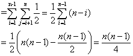
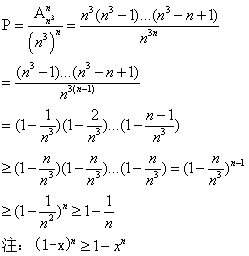
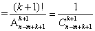
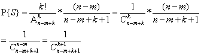
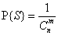

## Chapter 5  概率分析和随机算法

### 5.1 雇用问题  

#### 5.1-1
证明：假设有 a1, a2 , ... , an 应聘者，只知道部分次序      
不妨设知道的次序为b1 < b2 < ... < bm , 不知道的次序 bm+1 , ... , bn     
此时所知道的最佳为bm, 但可能 m+1 < i < n, bi > bm     
则并不总能知道bm是所有人中的最佳，因此必须知道所有次序     

#### 5.1-2
1)算法如下:   

    if(a==b)return a;
    else
      num = a;
      ix = b -a ;
      for(i = 0; i < ix; i++)
        num += RANDOM(0,1);
    return num;

2)期望运行时间： O(b-a)    

#### 5.1-3
1)算法如下:

    while true
      x = BIASED_RANDOM();
      y = BIASED_RANDOM();
      if(x != y)
        return x;

2)期望运行时间：1/(2p(1-p))   

### 5.2 指示器随机变量

#### 5.2-1
1) 雇用一次：最好的在第一个，其他随意，可能情况(n-1)!   
   所用的情况为 n!   
   P = 1/n    

2) 雇佣n次：按照依次递增的方式出现，P = 1/n!    

#### 5.2-2
第一个应聘者质量必然小于n,不妨设为k(1<= K <= n-1).     
当第一个应聘者质量为k时，要聘用两次，在质量为k+1 ~ n-1之间的都要在质量n的后面，此时聘用两次概率为：     
P = (n-k+1)! / (n-k)! = 1/(n-k)     
则雇用两次概率：     
P = Σ(1/n) * (1/(n-k)) = 1/n(ln(n-1) + O(1))    

#### 5.2-3
单个：E(X) = 1/6 * (1 + 2 + 3 + 4 + 5 + 6) = 3.5     
n个：E(nX) = nE(X) = 3.5n   

#### 5.2-4
设Xi = {0:第i位没有拿到帽子；1：第i位拿到了帽子}(1<= i <= n)    
第一位拿到帽子的概率：P = 1/n      
第二位拿到的概率：P = (1-1/n) * 1/(n-1) = 1/n     
则第i位拿到帽子概率：P = 1/n     
E(X) = ΣE(Xi) = Σ1/n = 1   

#### 5.2-5   
设Xij = {0:i<j,Xi<Xj；1:i<j,Xi>Xj}(1<= i <=n-1,i<j<=n)   
因为任意两个数逆序的概率为1/2，所以P{Xij=1}=1/2     
E(X) = Σ(E(Xij)) =     

### 5.3 随机算法    

#### 5.3-1

    RANDOMIZE-PLACE(A)
      n = A.length
      swap A[1] with A[RANDOM(1,n)]
      for i = 2 to n
        swap A[i] with A[RANDOM(i,n)]

证明：    
初始化：循环开始前子数组A[1]为A[1,...,n]中任意一个数，其出现概率1/n = (n-1)!/n!        
保持：假设第i次迭代前为(n-i+1)!/n!,当i次迭代，第i个数为1/(n-i+1),所以第i次迭代后为(n-i)!/n!    
终止：i = n + 1，子数组A[1,...,n]为一个给定n排列概率为1/n!  

#### 5.3-2
不能，P{第i个数出现} = 1/(n-i)     
P{形成一种排列} = 1/(n-1) * 1/(n-2) * ... * 1 = 1/(n-1)! ≠ 1/n!     

#### 5.3-3
不能，P{第i个数出现} = 1/n     
P{形成一种排列} = 1/n * 1/n * ... * 1/n = 1/(n^n) ≠ 1/n!  

#### 5.3-4
1) offset 可能取值 1,...,n ，P{offset = k} = 1/n     
   5 ~ 7行 表明 dest 可能取值 1,...,n，P{dest = k} = 1/n     
   不妨设A[i]出现在第k位置     
   所以P{A[1] = k} = 1/n      
   P{A[2] = k} = (n-1)/n * 1/(n-1) = 1/n  
   ....     
   P{A[n] = k} = (n-1)/n * (n-2)/(n-1) * ... * 1 = 1/n

2) 假设A[1]出现在第k位置，P{A[1] = B[k]} = 1/n      
   之后A[2,...,n]出现的位置便被固定，A[2] = B[(k+1)%n]，A[3] = B[(k+2)%n]，...，A[n] = B[(k+n-1)%n]    
   P{形成一种排列} = 1/n ≠ 1/n!     

#### 5.3-5      

#### 5.3-6
当优先级相同时重新生成直到不同为止    

#### 5.3-7
1) 显然，当 m 从m ~ 0,RANDOM调用了m次     

2) 证明：不妨从下往上思考，即m = k = 0 , S = {}      
  初始化：当 k = 1 时，i = {1, ... , n-m+1},P{S = {i}} = 1/(n-m+1)        
  保持：假设当k = k ,P{S} = k!/(n-m+k)...(n-m+1) , 当 k = k+1 时，i = {1, ... , n-m+k+1}     
  A) P{i∈S} = P{S∪{n-m+k+1}} = (k+1)/(n-m+k+1)     
  P{S} = k!/(n-m+k)! * (k+1)/(n-m+k+1)    
       
  B) P{i !∈ S} = P{S∪{i}} = (n-m)/(n-m+k+1)
  P{S} = k!/(n-m+k)! * (n-m)/(n-m+k+1)
       
  终止：当 k = m 时,      

### 5.4 概率分析和指示器随机变量的进一步使用

#### 5.4-1    
