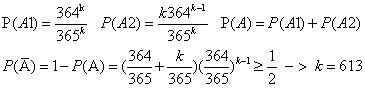
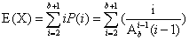
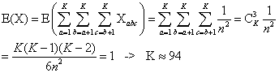
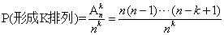
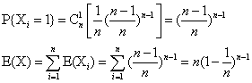
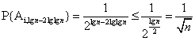
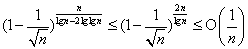
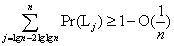

## Chapter 5  概率分析和随机算法

### 5.1 雇用问题  

#### 5.1-1
证明：假设有 a1, a2 , ... , an 应聘者，只知道部分次序      
不妨设知道的次序为b1 < b2 < ... < bm , 不知道的次序 bm+1 , ... , bn     
此时所知道的最佳为bm, 但可能 m+1 < i < n, bi > bm     
则并不总能知道bm是所有人中的最佳，因此必须知道所有次序     

#### 5.1-2
1)算法如下:   

    if(a==b)return a;
    else
      num = a;
      ix = b -a ;
      for(i = 0; i < ix; i++)
        num += RANDOM(0,1);
    return num;

2)期望运行时间： O(b-a)    

#### 5.1-3
1)算法如下:

    while true
      x = BIASED_RANDOM();
      y = BIASED_RANDOM();
      if(x != y)
        return x;

2)期望运行时间：1/(2p(1-p))   

### 5.2 指示器随机变量Xi

#### 补充
| i= | 1 | 2 | ... | n |
| - | - | - | - | -|              
| Xi= | X1 | X2 | ... | Xn |
| Pi= | P1 | P2 | ... | Pn |    
E(X) = ∑(Xi * Pi)

#### 5.2-1
1) 雇用一次：最好的在第一个，其他随意，可能情况(n-1)!   
   所用的情况为 n!   
   P = 1/n    

2) 雇佣n次：按照依次递增的方式出现，P = 1/n!    

#### 5.2-2
第一个应聘者质量必然小于n,不妨设为k(1<= K <= n-1).     
当第一个应聘者质量为k时，要聘用两次，在质量为k+1 ~ n-1之间的都要在质量n的后面，此时聘用两次概率为：     
P = (n-k+1)! / (n-k)! = 1/(n-k)     
则雇用两次概率：     
P = Σ(1/n) * (1/(n-k)) = 1/n(ln(n-1) + O(1))    

#### 5.2-3
单个：E(X) = 1/6 * (1 + 2 + 3 + 4 + 5 + 6) = 3.5     
n个：E(nX) = nE(X) = 3.5n   

#### 5.2-4
设Xi = {0:第i位没有拿到帽子；1：第i位拿到了帽子}(1<= i <= n)    
第一位拿到帽子的概率：P = 1/n      
第二位拿到的概率：P = (1-1/n) * 1/(n-1) = 1/n     
则第i位拿到帽子概率：P = 1/n     
E(X) = ΣE(Xi) = Σ1/n = 1   

#### 5.2-5   
设Xij = {0:i<j,Xi<Xj；1:i<j,Xi>Xj}(1<= i <=n-1,i<j<=n)   
因为任意两个数逆序的概率为1/2，所以P{Xij=1}=1/2     
E(X) = Σ(E(Xij)) =     

### 5.3 随机算法    

#### 5.3-1

    RANDOMIZE-PLACE(A)
      n = A.length
      swap A[1] with A[RANDOM(1,n)]
      for i = 2 to n
        swap A[i] with A[RANDOM(i,n)]

证明：    
初始化：循环开始前子数组A[1]为A[1,...,n]中任意一个数，其出现概率1/n = (n-1)!/n!        
保持：假设第i次迭代前为(n-i+1)!/n!,当i次迭代，第i个数为1/(n-i+1),所以第i次迭代后为(n-i)!/n!    
终止：i = n + 1，子数组A[1,...,n]为一个给定n排列概率为1/n!  

#### 5.3-2
不能，P{第i个数出现} = 1/(n-i)     
P{形成一种排列} = 1/(n-1) * 1/(n-2) * ... * 1 = 1/(n-1)! ≠ 1/n!     

#### 5.3-3
不能，P{第i个数出现} = 1/n     
P{形成一种排列} = 1/n * 1/n * ... * 1/n = 1/(n^n) ≠ 1/n!  

#### 5.3-4
1) offset 可能取值 1,...,n ，P{offset = k} = 1/n     
   5 ~ 7行 表明 dest 可能取值 1,...,n，P{dest = k} = 1/n     
   不妨设A[i]出现在第k位置     
   所以P{A[1] = k} = 1/n      
   P{A[2] = k} = (n-1)/n * 1/(n-1) = 1/n  
   ....     
   P{A[n] = k} = (n-1)/n * (n-2)/(n-1) * ... * 1 = 1/n

2) 假设A[1]出现在第k位置，P{A[1] = B[k]} = 1/n      
   之后A[2,...,n]出现的位置便被固定，A[2] = B[(k+1)%n]，A[3] = B[(k+2)%n]，...，A[n] = B[(k+n-1)%n]    
   P{形成一种排列} = 1/n ≠ 1/n!     

#### 5.3-5      

#### 5.3-6
当优先级相同时重新生成直到不同为止    

#### 5.3-7
1) 显然，当 m 从m ~ 0,RANDOM调用了m次     

2) 证明：不妨从下往上思考，即m = k = 0 , S = {}      
  初始化：当 k = 1 时，i = {1, ... , n-m+1},P{S = {i}} = 1/(n-m+1)        
  保持：假设当k = k ,P{S} = k!/(n-m+k)...(n-m+1) , 当 k = k+1 时，i = {1, ... , n-m+k+1}     
  A) P{i∈S} = P{S∪{n-m+k+1}} = (k+1)/(n-m+k+1)     
  P{S} = k!/(n-m+k)! * (k+1)/(n-m+k+1)    
       
  B) P{i !∈ S} = P{S∪{i}} = (n-m)/(n-m+k+1)
  P{S} = k!/(n-m+k)! * (n-m)/(n-m+k+1)
       
  终止：当 k = m 时,      

### 5.4 概率分析和指示器随机变量的进一步使用

#### 5.4-1    
1) 考虑对立事件 A = “没有人和我生日相同”，共有364^k种，P(A) = 364^k / 365^k            
P(A') = 1 - P(A)  ≥ 1/2       
= (1 - 1/365)^k ≥ 1/2  -> k >= 253       

2) 考虑事件 A = "至多一个人生日在7月4日" 该事件包括 A1 = “没有人生日在7月4日” 和 A2 = “只有一个人生日在7月4日”      
  

#### 5.4-2
X:"投球次数" = {2,3, ... , b+1}      
p{X=2} = 1/b  P(X=3) = 1/b * 1/(b-1) * 1/2     
...     
P{X=b+1} = 1/b * 1/(b-1) * ... * 1 * 1/b    
   

#### 5.4-3
两两独立就足够了，当计算两个人在同一天生日只用到了P{bi=r∧bj=r}=P{bi=r}P{bj=r},并没有彼此独立的公式      

#### 5.4-4
一年中的日子n = 365 人数：K     
P{有三个人生日在指定的一天相同}=P{bi=bj=bk=r} = 1/n^3       
P{存在三个人生日相同} = P{bi=bj=bk} = ∑ _ (r=1...n) (1/n^3) = 1/n^2         
设X_abc = I{a,b,c生日相同} = {1：相同；0：不同} (1≤a<b<c≤K)     
E(X_abc) = P{a=b=c} = 1/n^2      
       

#### 5.4-5
       
n相当于一年的日子数，k 代表有k个人 ，即是求该K个人生日各不相同的概率     

#### 5.4-6
1. Xi = I(第i个盒子空) = {1：空；0：有球} (1 ≤ i ≤ n)      
   第i个盒子空，代表n个球在其它的盒子中，P{Xi=1} = ((n-1)/n)^n    
   E(X) = ∑Xi = n * ((n-1)/n)^n          

2. Xi = I(第i个盒子有一个球) = {1：1个；0：其它} (1 ≤ i ≤ n)    
   第i个盒子有一个球，表示n次投掷过程中有1次进了盒子i，其它n-1次在其它盒子中，     
         

#### 5.4-7
令s = lgn-2lglgn ，分为 n/s 个组，考虑某组全是正面的概率：       
则长度至少是lgn-2lglgn不从i位置的概率至多是1-1/√n       
那么n/s个组中每个组都不是长度为lgn-2lglgn的概率至多是:       
则最长特征序列超过lgn-2lglgn的概率是:        
即是不出现比lgn-2lglgn更长的连续正面特征序列的概率：

### 思考题

#### 5-1     
**a.**    
设指示器随机变量Xi = I{第i次加n_{i+1}-ni}
|Xi|0|(n_{i+1}-ni)|  
|-|-|-|
|P|1-1/(n_{i+1}-ni)|1/(n_{i+1}-ni)|    
E(Xi) = 0*(1-1/(n_{i+1}-ni)) + (n_{i+1}-ni)* (1/(n_{i+1}-ni)) = 1    
E(X) = ∑(EXi) = n         

**b.**      
设指示器随机变量Xi = I{第i次加100}      
|Xi^2|0|10000|  
|-|-|-|
|P| 1-1/100 | 1/100 |
E(Xi^2) = 0*(1-1/100) + 10000 * 1/100 = 100    
var(Xi) = E(Xi^2) - (E(Xi))^2 = 99     
Var(X) = ∑var(Xi) = 99n     

#### 5-2    
**a.**     

    RANDOM-SEARCH(A,x)
    n = A.length      
    let B[n]{0}         //0:not choosed ; 1: choosed  
    num = 0             //have searched the num of A
    while num < n
      i = RANDOM(1,n)
      if B[i] == 1     // Had A[i] been choosed ?
        continued
      else
        if A[i] == x
          return i   
        else  
          B[i] = 1
          num += 1

**b.**  在第i次找到x之前，前i-1次可以任选除A[i]=x外的任何数，所以P{Xi = i} = ((n-1)/n)^(i-1) * (1/n)，为几何分布，EX = ∑iPi = n        

**c.** 同b,也为几何分布，P{Xi = i} = ((n-k)/n)^(i-1) * (k/n)，EX = ∑iPi = n/k     

**d.** 和每一个盒子均有一个小球的期望数相同，为n(lnn+O(1))     

**e.**       
P(X=1) = 1/n      
P(X=2) = (n-1)/n * 1/(n-1) = 1/n     
...    
P(X=n) = 1/n     
T(n) = ∑iPi = 1/n * ∑i = (n+1)/2 = O(n)       

**f.**   
平均情形：      
P(X=1) = k/n      
P(X=2) = (n-k)/n * k/(n-1)          
...    
P(X=n-k+1) = [K(n-k)(n-k-1)...(K+1)] / [n(n-1)...(n-k+1)]   
T(n) = ∑iPi = 1/n * ∑i = (n+1)/(k+1)      

最坏情形：n-k+1        

**g.** 最坏与平均情况均为O(n)        

**h.** 和第二种方法类似，只不过数组中数的顺序由算法决定，而不由输入决定    
k = 0，最坏与期望为O(n)    
k = 1, 最坏为O(n)，平均为O((n+1)/2)      
k ≥ 1, 最坏为O(n)，平均为O((n+1)/(k+1))     

**i.** 一般选择第二种，省去了全排列的时间        
