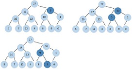
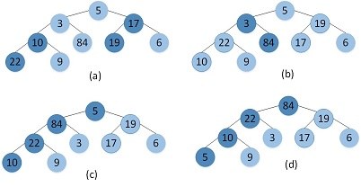

## Chapter 6  堆排序

### 6.1 堆
根据书中对堆高度的定义，最底下一层为第0层，倒数第二层为第1层，。。。，所以根节点处为第h层。     
某一个结点的高度为该结点到叶结点最长简单路径的边数，并不等于该层的高度。

#### 6.1-1
个数最多：表示最底下一层是满的，所以：Nmax = 1 + 2 + 2^2 + ... + 2^h = 2^(h+1)-1      
个数最少：表示最底下一层只有一个元素，所以：Nmin = 1 + 2 + 2^2 + ... + 2^(h-1) + 1 = 2^h       

#### 6.1-2    
当最底下一层是满的，即 2^(h+1)-1 = n --> h = lg(n+1)-1    
最底下一层只有一个元素: 2^h = n --> h = lgn    
一般最底下一层元素数： 1 ≤ n0 ≤ 2^h ,所以高度取 floor(lgn)    

#### 6.1-3   
证明：假设最大元素不在该子树的根节点上，不妨设为A[i]，i ≠ 1，  则A[i]有父元素，且A[i]≥A[parant(i)]，与堆的性质不符合，所以该子树的最大元素必然在该子树的根节点上。   

#### 6.1-4    
叶结点处

#### 6.1-5
是    

#### 6.1-6
不是，6为7的父结点       

#### 6.1-7      
证明：首先在第n元素后就没有元素了，所以第n元素必在叶结点上，第n元素的父结点位置为floor(n/2),所以在floor(n/2)之后的元素都没有孩子结点，因此叶结点的下标为floor(n/2)+1，floor(n/2)+2, ... , n 。     

### 6.2 维护堆的性质    

#### 6.2-1

#### 6.2-2

    MIN-HEAPIFY(A,i)
    l = LEFT(i)
    r = RIGHT(i)
    if l ≤ A.heap-size and A[l] < A[i]    
      smallest = l    
    else
      smallest = i
    if r ≤ A.heap-size and A[r] < A[i]
      smallest = r
    if i != smallest
      exchange A[i] and A[smallest]
      MIN-HEAPIFY(A,smallest)

T(n) = O(lgn)     

#### 6.2-3
在和左右孩子比较完后结束     

#### 6.2-4
得到没有左右孩子，而结束   

#### 6.2-5

    MAX_HEAPIFYNotRec(A,i)
    l = LEFT(i)
    r = RIGHT(i)
    largest = i
    //在存在左右孩子元素值大于根元素时开始循环
    while r ≤ A.heap-size and A[r] > A[largest] or l ≤ A.heap-size and A[l] > A[largest]
      i1 = largest
      if l ≤ A.heap-size and A[l] > A[largest]
        largest = l
      if r ≤ A.heap-size and A[r] > A[largest]
        largest = r
      if largest != i1    
        exchange A[largest] and A[i1]
        l = LEFT(i)
        r = RIGHT(i)

#### 6.2-6
证明：当某一个堆沿着最左边的时候，孩子元素都比根元素大的时候，A[lchild] > A[rchild] > A[parant] ,根元素值下降到最底层，此时为最坏的情况，运行时间为树的高度，Ω(lgn)      

### 6.3 建堆   

#### 6.3-1

#### 6.3-2
递减可以保证i之后的元素作为根形成的子树是一个最大堆，当其递增时，在i之后的元素无法交换到i之前的位置，可能导致从底部升上来的最大元素无法达到应该在的位置。

#### 6.3-3
证明：当某一个高度h有最多的元素，那么该行是满的，有2^h个元素，而且从h , h+1 , ... , hmax 这些行都应该是满的，另外高度为h-1行应该最多有一个元素，      
∴ 1 + 2 + 2^2 + ... + 2^h + 1 = n   

### 6.4 堆排序算法
