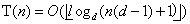

## Chapter 6  堆排序

### 6.1 堆
根据书中对堆高度的定义，最底下一层为第0层，倒数第二层为第1层，。。。，所以根节点处为第h层。     
某一个结点的高度为该结点到叶结点最长简单路径的边数，并不等于该层的高度。

#### 6.1-1
个数最多：表示最底下一层是满的，所以：Nmax = 1 + 2 + 2^2 + ... + 2^h = 2^(h+1)-1      
个数最少：表示最底下一层只有一个元素，所以：Nmin = 1 + 2 + 2^2 + ... + 2^(h-1) + 1 = 2^h       

#### 6.1-2    
当最底下一层是满的，即 2^(h+1)-1 = n --> h = lg(n+1)-1    
最底下一层只有一个元素: 2^h = n --> h = lgn    
一般最底下一层元素数： 1 ≤ n0 ≤ 2^h ,所以高度取 floor(lgn)    

#### 6.1-3   
证明：假设最大元素不在该子树的根节点上，不妨设为A[i]，i ≠ 1，  则A[i]有父元素，且A[i]≥A[parant(i)]，与堆的性质不符合，所以该子树的最大元素必然在该子树的根节点上。   

#### 6.1-4    
叶结点处

#### 6.1-5
是    

#### 6.1-6
不是，6为7的父结点       

#### 6.1-7      
证明：首先在第n元素后就没有元素了，所以第n元素必在叶结点上，第n元素的父结点位置为floor(n/2),所以在floor(n/2)之后的元素都没有孩子结点，因此叶结点的下标为floor(n/2)+1，floor(n/2)+2, ... , n 。     

### 6.2 维护堆的性质    

#### 6.2-1

#### 6.2-2

    MIN-HEAPIFY(A,i)
    l = LEFT(i)
    r = RIGHT(i)
    if l ≤ A.heap-size and A[l] < A[i]    
      smallest = l    
    else
      smallest = i
    if r ≤ A.heap-size and A[r] < A[i]
      smallest = r
    if i != smallest
      exchange A[i] and A[smallest]
      MIN-HEAPIFY(A,smallest)

T(n) = O(lgn)     

#### 6.2-3
在和左右孩子比较完后结束     

#### 6.2-4
得到没有左右孩子，而结束   

#### 6.2-5

    MAX_HEAPIFYNotRec(A,i)
    l = LEFT(i)
    r = RIGHT(i)
    largest = i
    //在存在左右孩子元素值大于根元素时开始循环
    while r ≤ A.heap-size and A[r] > A[largest] or l ≤ A.heap-size and A[l] > A[largest]
      i1 = largest
      if l ≤ A.heap-size and A[l] > A[largest]
        largest = l
      if r ≤ A.heap-size and A[r] > A[largest]
        largest = r
      if largest != i1    
        exchange A[largest] and A[i1]
        l = LEFT(i)
        r = RIGHT(i)

#### 6.2-6
证明：当某一个堆沿着最左边的时候，孩子元素都比根元素大的时候，A[lchild] > A[rchild] > A[parant] ,根元素值下降到最底层，此时为最坏的情况，运行时间为树的高度，Ω(lgn)      

### 6.3 建堆   

#### 6.3-1

#### 6.3-2
递减可以保证i之后的元素作为根形成的子树是一个最大堆，当其递增时，在i之后的元素无法交换到i之前的位置，可能导致从底部升上来的大元素无法达到应该在的位置。

#### 6.3-3
证明：      
1. 当 h = 0 时，6.1-7指出有 ceil(n/2)+1, ceil(n/2)+2, ... , n 个叶结点，这些所处的层数为第0层，共 ceil(n/2) = ceil(n/2^(0+1)) 。             
2. 假设h = k 时至多有 ceil(n/2^(k+1))个元素，那么当 h = k-1时,...  
   * 这ceil(n/2^(k+1))个元素全在同一高度，那么当h = k-1层最多时，为k层的两倍，即为ceil(n/2^(k+1)) * 2 = ceil(n/2^(k-1+1))个元素；    
   * 这ceil(n/2^(k+1))个元素不在同一高度，那么不妨设有下一层的i,没有的为j, j个元素为叶子，则对应的没有第k+1层元素，第k+1层为i的孩子，最多有2i个，2i ≤ ceil(n/2^(k-1+1))    
3. 综上所述，至多有ceil(n/2^(h+1))个第h层元素。     

### 6.4 堆排序算法

#### 6.4-1     

#### 6.4-2
证明：
* 初始化：当i=A.length之前，由于BUILD-MAX-HEAP(A)作用，1 ~ A.length形成了一个最大堆，而[A.length+1,...,n]为空数组，是一个已经排好序的部分；
* 保持：第i次迭代前，A[1,...,i]是一个最大堆，A[i+1,...,n]是一个已经排好序的数组部分，在第i次迭代后，由于heap-size-1，所以在维护最大堆性质时只是A[1,...,i]的部分，并没有影响之后A[i+1,...,n]的部分，所以该部分不变，由于MAX-HEAPIFY(1)的作用，A[1,...,i]形成了一个最大堆；
* 终止：在i = 2循环完成后，A[1,...,1]只有一个元素，形成了一个最大堆，而A[2,...,n]已经排好序了，加上第一个也就形成了最终结果。

#### 6.4-3
* 升序：由于要形成一个最大堆，所以时间还是Ω(nlgn)    
* 降序：已经是一个最大堆，但排序后，时间还是Ω(nlgn)      

#### 6.4-4
最坏情况，循环过程要全部执行一次，即MAX-HEAPIFY(1)执行(n-1)次。由于MAX-HEAPIFY(1)时间为lgn,所以时间复杂度为Ω(nlgn)     

#### 6.4-5    
由于堆排序属于比较排序，而比较排序的下限为Ω(nlgn)      

### 6.5 优先队列     

#### 6.5-1

#### 6.5-2

#### 6.5-3

    HEAP-MINMUM(A)
    return A[1]

    HEAP-EXTRACT-MIN(A)
    if heap-size < 1
      error "heap underflow"
    min = A[1]
    exchange A[1] and A[heap-size]     
    heap-size = heap-size-1
    MINHEAPIFY(A,1)
    return min     

    HEAP-DECREASE-KEY(A,i,key)
    if i < 1 || i > heap-size
      error "wrong i"
    else if key > A[i]   
      error "needn't decrease"    
    else
      A[i] = key    
      while i > 1 && A[i] < A[PARENT(i)]
        exchange A[i] and A[PARENT(i)]  
        i = PARENT(i)     

    MIN-HEAP-INSERT(A,key)
    heap-size = heap-size + 1
    A[heap-size] = +∞   
    HEAP-DECREASE-KEY(A,heap-size,key)   

#### 6.5-4
首先数组会在此初始化一个值，如果要插入的值过小，则没办法正确的插入该值，通常初始化为0，如插入负数，就因为在HEAP-INCREASE-KEY中判断比原值小，而无法插入。另外如果数组没有初始化一个值，就会产生错误，因此此处设置比key小即可(key' <= key - 1)。   

#### 6.5-5
证明：
* 初始化：第一次循环前，由于A[i]增大为key，所以A[i]及其子树满足最大堆性质，但可能A[i] > A[parent(i)],仅此一点不满足最大堆性质；    
* 保持：在第i次迭代前，A[i]及其子树满足最大堆性质，A[i]大于A[parent(i)]，在i次迭代后，两个值交换，A[i]及其子树满足最大堆性质；   
* 终止，这时A[i]来到了根部或者A[i]≤A[parent(i)]，那么整个树满足最大堆性质，A[i]到了合适的位置。    

#### 6.5-6

    while i > 1 and A[i] > A[PARENT(i)]
      A[i] = A[PARENT(i)]
      i = PARENT(i)
    A[i] = key   

#### 6.5-7  
1. 先进先出队列：给予每个入队的一个优先级，先进的最大，然后构造最大优先队列，出队列时调用HEAP-EXTRACT-MIN即可

2. 栈：给予每个入队的一个优先级，先进的最小，然后构造最大优先队列

#### 6.5-8

    HEAP-DELETE(A,i)
    if i < 1 || i > heap-size
      error "wrong index"  
    temp = A[i]
    A[i] = A[heap-size]
    heap-size = heap-size - 1
    MAXHEAPIFY(A,i)   
    return temp     

#### 6.5-9

    MERGE-K-LIST(A[1,...,k],n)
    以A[j]的第一个元素构造一个最小堆
    let B[n] a new array
    for i = 1 to n
      B[i] = 堆的第一个元素
      将对应链表的下一个元素补充到堆的第一个位置
      MINHEAPIFY()     //维护堆的性质

### 思考题

#### 6-1
**a.** 不相同，如输入数据1,2,3,4,5     
BUILD-MAX-HEAP : ，BUILD-MAX-HEAP' :       

**b.**   
在最坏情况下，每个元素都要上升当前树的高度，才能达到合适的位置，所以：

#### 6-2
**a.** 按顺序依次存放在数组中，其中 i*d-d+2 ~ i*d+1 为元素i的子元素，父元素求法如下：

    PARENT(i,d)
    if i == 1  
      error "No parent"
    j = i/d    
    if d*j-d+2 <= i and i <= j*d+1
      return j
    else
      return j+1

**b.**    

**c.** 

    EXTRACT-MAX(A)
    max = A[1]
    A[1] = A[size]
    size = size - 1
    MAXHEAPIFY(A,1)
    return max   

**d.**  

    INSERT(A,key)
    size = size + 1
    A[size] = key   
    if size == 1
      return   
    i = size   
    while i > 1 and A[i] > A[PARENT(i)]
      exchange A[i] and A[PARENT(i)]
      i = PARENT(i)

**e.** 

    INCREASE-KEY(A,i,key)
    if i < 1 or i > size
      error "wrong index"
    else if A[i] > key   
      error "wrong key"   
    else
      A[i] = key
      while i > 1 and A[i] > A[PARENT(i)]
        exchange A[i] and A[PARENT(i)]
        i = PARENT(i)

#### 6-3
**a.**
