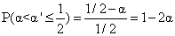

## Chapter 7  快速排序

### 7.1 快速排序的描述

#### 7.1-1
1. [[13],19,[9],5,12,8,7,4,21,2,6,{11}]
2. [9,[19],13,[5],12,8,7,4,21,2,6,{11}]
3. [9,5,[13],19,12,[8],7,4,21,2,6,{11}]
4. [9,5,8,[19],12,13,[7],4,21,2,6,{11}]
5. [9,5,8,7,[12],13,19,[4],21,2,6,{11}]
6. [9,5,8,7,4,[13],19,12,21,[2],6,{11}]
7. [9,5,8,7,4,2,[19],12,21,13,[6],{11}]
8. [9,5,8,7,4,2,6,{12},21,13,19,{11}]
9. [9,5,8,7,4,2,6,{11},21,13,19,12]

#### 7.1-2  
* 相同时，返回r;
* if (i+1 == r && A[i+1] == A[r])  return (p+q)/2    

#### 7.1-3
证明：在程序4 ~ 6行若运行则是时间最多的步骤，从j = p ~ r-1 ,而4~6行是常量时间，因此T(n) = Σ1 = n = O(n)    

#### 7.1-4
将4行 A[j] <= x 替换为 A[j] >= x    

### 7.2 快速排序的性能

#### 7.2-1
证明：
* 假设 T(n) <= cn^2 , T(1) = c   
T(n) = c(n-1)^2 + n = cn^2 - [(2c-1)n+c]    
当 2c-1 >= 0 -> c >= 1/2 时，    
T(n) <= cn^2 = O(n^2)    
* 假设 T(n) >= dn^2 , T(1) = d   
T(n) = d(n-1)^2 + n = dn^2 + [(1-2d)n+d]   
当 1-2d >= 0 -> d <= 1/2 时，   
T(n) >= dn^2 = Ω(n^2)    
* T(n) = Θ(n^2)    

#### 7.2-2
T(n) = Θ(n^2)   

#### 7.2-3
证明：当元素互异时，每当选取最后一个元素为主元，会划分成（n-1）个元素 和 0 个元素的两个集合，所以 T(n) = T(n-1) + θ(n) = θ(n^2)。   

#### 7.2-4
证明：   
* 对于INSERTION-SORT，已经有序的输入，便不会做内层循环的移动操作，因而时间接近于θ(n)；
* 对于QUICKSORT，已经有序的输入，会划分成（n-1）个元素 和 0 个元素的两个集合，所以 T(n) = T(n-1) + θ(n) = θ(n^2)；
* 所以INSERTION-SORT性能更好。

#### 7.2-5
证明：  
* 最短的路径为 n , nα , nα^2 , ... , nα^h , ... , 1    
令 nα^h = 1 -> h = log_α(1/n) = -lgn/lgα    

* 最长的路径为：n , n(1-α) , n(1-α)^2 , ... , n(1-α)^h , ... , 1   
令 n(1-α)^h = 1 -> h = log_(1-α)(1/n) = -lgn/lg(1-α)      

#### 7.2-6   
证明：对于一个n个元素的数组，以α：1-α进行划分，不妨设有nα个小于主元的元素，n(1-α)个大于主元的元素，若更平衡，新的划分α'满足α < α' <= 1/2 , 所以：  

### 7.3 快速排序的随机化版本

#### 7.3-1
因为当输入分布不再影响顺序，而是有随机过程决定，那么最坏情况的发生的概率也就减小了，最可能出现的是平均情况，因此用期望运行时间。

#### 7.3-2
* 最好情况：Θ(lgn)   
* 最坏情况：Θ(n^2)    

### 7.4 快速排序分析  
 
