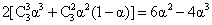
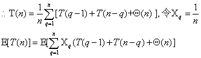
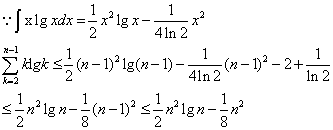
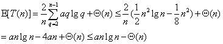
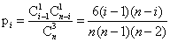
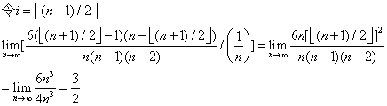
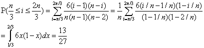

## Chapter 7  快速排序

### 7.1 快速排序的描述

#### 7.1-1
1. [[13],19,[9],5,12,8,7,4,21,2,6,{11}]
2. [9,[19],13,[5],12,8,7,4,21,2,6,{11}]
3. [9,5,[13],19,12,[8],7,4,21,2,6,{11}]
4. [9,5,8,[19],12,13,[7],4,21,2,6,{11}]
5. [9,5,8,7,[12],13,19,[4],21,2,6,{11}]
6. [9,5,8,7,4,[13],19,12,21,[2],6,{11}]
7. [9,5,8,7,4,2,[19],12,21,13,[6],{11}]
8. [9,5,8,7,4,2,6,{12},21,13,19,{11}]
9. [9,5,8,7,4,2,6,{11},21,13,19,12]

#### 7.1-2  
* 相同时，返回r;
* if (i+1 == r && A[i+1] == A[r])  return (p+q)/2    

#### 7.1-3
证明：在程序4 ~ 6行若运行则是时间最多的步骤，从j = p ~ r-1 ,而4~6行是常量时间，因此T(n) = Σ1 = n = O(n)    

#### 7.1-4
将4行 A[j] <= x 替换为 A[j] >= x    

### 7.2 快速排序的性能

#### 7.2-1
证明：
* 假设 T(n) <= cn^2 , T(1) = c   
T(n) = c(n-1)^2 + n = cn^2 - [(2c-1)n+c]    
当 2c-1 >= 0 -> c >= 1/2 时，    
T(n) <= cn^2 = O(n^2)    
* 假设 T(n) >= dn^2 , T(1) = d   
T(n) = d(n-1)^2 + n = dn^2 + [(1-2d)n+d]   
当 1-2d >= 0 -> d <= 1/2 时，   
T(n) >= dn^2 = Ω(n^2)    
* T(n) = Θ(n^2)    

#### 7.2-2
T(n) = Θ(n^2)   

#### 7.2-3
证明：当元素互异时，每当选取最后一个元素为主元，会划分成（n-1）个元素 和 0 个元素的两个集合，所以 T(n) = T(n-1) + θ(n) = θ(n^2)。   

#### 7.2-4
证明：   
* 对于INSERTION-SORT，已经有序的输入，便不会做内层循环的移动操作，因而时间接近于θ(n)；
* 对于QUICKSORT，已经有序的输入，会划分成（n-1）个元素 和 0 个元素的两个集合，所以 T(n) = T(n-1) + θ(n) = θ(n^2)；
* 所以INSERTION-SORT性能更好。

#### 7.2-5
证明：  
* 最短的路径为 n , nα , nα^2 , ... , nα^h , ... , 1    
令 nα^h = 1 -> h = log_α(1/n) = -lgn/lgα    

* 最长的路径为：n , n(1-α) , n(1-α)^2 , ... , n(1-α)^h , ... , 1   
令 n(1-α)^h = 1 -> h = log_(1-α)(1/n) = -lgn/lg(1-α)      

#### 7.2-6   
证明：对于一个n个元素的数组，以α：1-α进行划分，不妨设有nα个小于主元的元素，n(1-α)个大于主元的元素，若更平衡，新的划分α'满足α < α' <= 1/2 , 所以：  

### 7.3 快速排序的随机化版本

#### 7.3-1
因为当输入分布不再影响顺序，而是由随机过程决定，那么最坏情况的发生的概率也就减小了，最可能出现的是平均情况，因此用期望运行时间。

#### 7.3-2
* 最好情况：Θ(lgn)   
* 最坏情况：Θ(n)    

### 7.4 快速排序分析  

#### 7.4-1
证明：假设T(n) ≥ cn^2    
T(n) ≥ min(cq^2 + c(n-1-q)^2) + Θ(n) = cmin(q^2 + (n-1-q)^2) + Θ(n) {1 ≤ q ≤ n-1}    
对于f(q) = q^2 + (n-1-q)^2  {1 ≤ q ≤ n-1}    
令f'(q) = 4q - 2n + 2 = 0  ->  q = (n-1)/2     
∵ f''(q) = 4 > 0  ∴ f(q) 当q = (n-1)/2取极小值   
∴ 当c充分大时， T(n) ≥ c/2(n-1)^2 + Θ(n) ≥ cn^2 + c/2(1-n^2-2n) ≥ cn^2    
∴ T(n) = Ω(n^2)     

#### 7.4-2
证明：由于在最好的时候 T(n) = 2T(n/2) + Θ(n)    
假设T(n) ≥ cnlgn    
∴ T(n) ≥ 2cn/2lg(n/2) + Θ(n) = cnlgn - cn ≥ cnlgn        
∴ T(n) = Ω(nlgn)    

#### 7.4-3   
证明：已经由**7.4-1**得出一阶导数在q = (n-1)/2 处有极小值，在[0,(n-1)/2]为减函数，[(n-1)/2,(n-1)]为增函数，所以在端点处有最大值，由于q = 0 和 q = n-1 两值相等，所以在q = 0 和 q = n-1 处有最大值。     

#### 7.4-4   

#### 7.4-5
如图：    
树的高度为：n(1/2)^h = k -> h = lg(n/k)   
每层代价为cn , 所以快速排序部分为O(nlg(n/k))   
每k个元素为插入排序，总共有2^(lg(n/k)) = n/k 个叶子，所以插入排序部分为O(k^2 * n/k) = O(nk)    
综上所述，期望运行时间为O(nk+nlg(n/k))    
理论上：nk + nlg(n/k) ≤ nlgn -> k-lgk ≤ 0   

#### 7.4-6   
把A划分为nα,n(1-α)两个部分，为了使最坏划分为α：1-α，那么所选出的元素，即三个元素的中位数应该在[1,...,nα] (0 < α < 1/2) 或者在[n(1-α),...,n] (1/2 < α < 1)之中，也就是三个数中应该有两个或以上的元素满足该条件，所以：    
P(最坏划分比例为α：1-α) = 2[P(三个满足条件)+P(存在两个满足条件)] = 

### 思考题

#### 7-1  
**a.**    
{13,19,9,5,12,8,7,4,11,2,6,21}  j = 13 i = 0 x = 13   
{[6],19,9,5,12,8,7,4,11,2,[13],21}  j = 11 i = 1 x = 13    
{6,[13],9,5,12,8,7,4,11,2,[19],21}  j = 11 i = 2 x = 13    
{6,[2],9,5,12,8,7,4,11,[13],19,21}  j = 10 i = 2 x = 13        
{6,2,9,5,12,8,7,4,11,[13],19,21}  j = 10 i = 10 x = 13     

**b.** 根据5 ~ 7行，在判断A[j]<=x前，j=j-1,因此j<=r, 另外当i>=j时，就会返回j,所以j<=i,根据8 ~ 10行，在判断A[i]>=x前，i=i+1,所以i>=p,因此所返回的j不会超出范围。    

**c.**    
+ 根据5 ~ 7行，在判断A[j]<=x前，j=j-1,因此j<=r, 但是x=A[p],所以当j=r且A[j]>x时，j = j - 1 != r,A[j]<=x时，而A[i]=x,所以这时A[i]与A[j]互换，到下一次循环，j=j-1，因此j<r;
+ 另外一方面，当A[p+1,...r]均大于A[p]时，j down to p,i = p,因此在交换完A[i]与A[j]后，便会返回j,此时j=p。   
+ 综上：p <= j < r    

**d.**  假设在返回 j 时，在A[p, ... , j]中存在A[x]大于A[j+1, ... , r]的元素，即是A[x] > A[j]成立，那么 i 并没有经过 x ,即是 i < x < j，此时程序并没有结束，所以在A[p, ... , j]中不存在A[x]大于A[j+1, ... , r]的元素。  

**e.** [hoarePartition](QuickSort.java)    

#### 7-2   
**a.** O(n^2)  

**b.** [sameParitition](SameQuickSort.java)

**c.** [quick sort](SameQuickSort.java)  

**d.** 元素值相同的部分，即A[q,...,t]不参与比较过程   

#### 7-3
**a.**    
* 证明：随机过程是在A[1 , .... , n]中随机选一个数，然后和末尾元素交换，每一个A[i]被选中的概率都是等可能的。

* E[Xi] = 1/n    

**b.**    
when 0:(n-1) T(n) = T(0) + T(n-1) + Θ(n)   
when 1:(n-2) T(n) = T(1) + T(n-2) + Θ(n)    
.....   
when (n-1):0 T(n) = T(n-1) + T(0) + Θ(n)   
   

**c.**    
T(0) = 0    
由 **b.** 知存在两个T(n) = T(q-1)+T(n-q)，将对应两项相加并除以2，得到对应结果。   

**d.**      

**e.**   
证明：假设存在a,使得E[T(n)] <= anlgn     
    
当 a 充分大时，式子成立，所以 E[T(n)] = Θ(nlgn)     

#### 7-4   
**a.** 证明：   
+ 初始化：循环前假设 q = 0,则A[p,q-1]空数组,相当于已排序好；
+ 保持：A[1,...,p-1]已经排序好，在获得q后，对A[p,...,q-1]排序完成，使得A[1,...,q]为排好序的数组，在p = q + 1后，即是A[1,...,p-1]是排序好的数组；   
+ 终止：此时 p >= r ，那么A[1,...,p-1]排序好，即是A[1,...,r]是排好序的数组。   

**b.** 一直出现 0:(n-1) 的划分时，即是数组已经排好序的情况    

**c.** q = RANDOMIZED-QUICKSORT(A,p,r)    

#### 7-5   
**a.**    

**b.**    

**c.** 

**d.** 尽管取了中值，但是仍然将数组分为两个部分，每个部分仍然要做递归，其实只是相当于随机选择一个主元，而没有更改递归树的本质。   

#### 7-6  
**a.** [模糊排序](FuzzySort.java)  

**b.**
+ 相当于快速排序划分，分成两个部分 .

+ 当所有区间有重叠时，便相当于相同区间，第一次划分返回整个数组，便不用再做之后的递归，此时的时间为划分区间所用时间Θ(n) .
