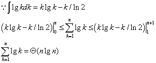
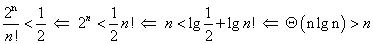

## Chapter 8  线性时间排序

### 8.1 排序算法的下界

#### 8.1-1
当输入的数据已经排序好，形成以下比较序列：1:2,2:3，。。。，n-1：n,此时形成最小深度 (n-1)   

#### 8.1-2
   

#### 8.1-3
要达到线性时间，则做的结果在决策树上应该在高度为n的位置。此时最多的叶子数最多有 2^n 个，总的叶子数有 n! 个；   
* 达到 1/2 , 因为 ,所以不存在。    
* 达到 1/n ，因为 lg(n-1)! > n -> 2^n/n! < 1/n  也不成立。    
* 达到 1/2^n , 因为 2^n/n! > 1/2^n ,所以存在。

#### 8.1-4
对于每一个子序列，总共有 k! 种输出，有 n/k 个子序列，也就总共有 (k!)^(n/k) 个输出情况，由 2^ >= (k!)^(n/k)     
所以： h >= (n/k)lg(k!) = Ω(nlgk)     

### 8.2 计数排序   

#### 8.2-1   
* A:{6,0,2,0,1,3,4,6,1,3,2} C:{2,2,2,3,1,0,2}      C:{2,4,6,8,9,9,11}  B{ , , , , , , , , , , }   
* B{ , , , , , 2 , , , , , }   C:{2,4,5,8,9,9,11}  
* B{ , , , , , 2 ,  , 3 , , , }   C:{2,4,5,7,9,9,11}  
* B{ , , , 1 , , 2 ,  , 3 , , , }   C:{2,3,5,7,9,9,11}  
* B{ , , , 1 , , 2 ,  , 3 , , , 6 }   C:{2,3,5,7,9,9,10}  
* B{ , , , 1 , , 2 ,  , 3 , 4 , , 6 }   C:{2,3,5,7,8,9,10}
* B{ , , , 1 , , 2 , 3  , 3 , 4 , , 6 }   C:{2,3,5,6,8,9,10}
* B{ , , 1 , 1 , , 2 , 3  , 3 , 4 , , 6 }   C:{2,2,5,6,8,9,10}
* B{ , 0 , 1 , 1 , , 2 , 3  , 3 , 4 , , 6 }   C:{1,2,5,6,8,9,10}
* B{ , 0 , 1 , 1 , 2 , 2 , 3  , 3 , 4 , , 6 }   C:{1,2,4 ,6,8,9,10}    
* B{ 0 , 0 , 1 , 1 , 2 , 2 , 3  , 3 , 4 , 6 , 6 }   C:{0,2,4 ,6,8,9,9}    

#### 8.2-2   
根据第10 ~ 12行，C计算出现的个数，对应于A中在正确序列上的位置，在统计完后,C中的数较大，当从数组最后一个开始填入，对于相同的元素，位于较后的填入大的位置上，因而是稳定的。    

#### 8.2-3   
证明：  
* 当j = 0，B 数组为空，相当于元素已经到了合适的位置 ；  
* 当前面 j 个元素已经在B中到了合适的位置，第 j+1 个元素的位置有两种情况: 1) 之前没有出现过相同元素，那么B[C[A[j+1]]]为空，是对应A[j+1]的合适位置，2) 出现过相同元素，那么由于第一次出现时 C[A[j']] = C[A[j']] - 1 ，所以B[C[A[j+1]]]为空，是对应A[j+1]的合适位置；   
* 当终止时，所有元素都到了合适的位置，因而算法正确。   
* 由于 j = j + 1,所以前面的元素位于后面的位置，所以不稳定。   

#### 8.2-4 [intervals](NumSort.java)   

### 8.3 基数排序  

#### 8.3-1

|0|1|2|3|    
|-|-|-|-|   
|COW|SEA|TAB|BAR|
|DOG|TEA|BAR|BIG|
|SEA|MOB|EAR|BOX|
|RUG|TAB|TAR|COW|
|ROW|DOG|SEA|DIG|
|MOB|RUG|TEA|DOG|
|BOX|DIG|DIG|EAR|
|TAB|BIG|BIG|FOX|
|BAR|BAR|MOB|MOB|
|EAR|EAR|DOG|NOW|
|TAR|TAR|COW|ROW|
|DIG|COW|ROW|RUG|
|BIG|ROW|NOW|SEA|
|TEA|NOW|BOX|TAB|
|NOW|BOX|FOX|TAR|
|FOX|FOX|RUG|TEA|  

#### 8.3-2  
* 稳定的：插入排序，归并排序   
* 不稳定：堆排序，快速排序   
* 稳定方法：记录下相同元素的相对位置，在排序完成后，再根据此记录数据重新排序，空间为O(n)   

#### 8.3-3
证明：假设当前排序第t位，前t-1位都已经排序完成，开始第t位排序时有以下两种情况：  
1) 当第t位相同时，不需要改变位置，这里需要排序算法稳定；  
2) 当第t位不同时，排序完成后，会移动到合适的地方，完成排序；       

当最后一位完成后，整个序列已经有序。      

#### 8.3-4     
以n进制，则最多需要log_n{n^3-1} = 2位n进制数，即最多需要两轮，对每一轮进行排序，k = n,所以总的时间为 O(2(n+n)) = O(4n)   

#### 8.3-5  
需要d轮排序；纪录10堆

### 8.4 桶排序   

#### 8.4-1  
0 :      
1 : 0.13 -> 0.16    
2 : 0.20     
3 : 0.39   
4 : 0.42   
5 : 0.53   
6 : 0.64   
7 : 0.71 -> 0.79       
8 : 0.89   
9 :           

#### 8.4-2   
* 最坏情况：当恰好落入一个桶中时      
- 将第8行改为O(nlgn)的算法即可     

#### 8.4-3      
|X = |0|1|2|
|-|-|-|-|  
|P = |1/4|1/2|1/4|      

E[x] = 1  
E[x^2] = 1 * 1/2 + 4 * 1/4 = 3/2     
E^2[X] = 1       

#### 8.4-4      
设定n个桶，每一个点落入到对应桶中所对应的面积应该为总面积的1/n，由于概率与d有关，因此将圆分成n个环，每个环的面积为 pi/n, 所以第i个环半径为 sqrt(1/n) .   

    SORT(A)
      n = A.length
      let B[0,...,n-1] be a new array
      for i = 0 to n-1
        make B[i] be a empty list
      for i = 1 to n
        let k = A[i].x^2 + A[i].y^2
        insert A[i] to B[k/n]   
      for i = 0 to n-1
        sort B[i]    
      contact the list B[0],...,B[n-1]   

#### 8.4-5    
在 n * O(1) = O(n) 时间内找到，然后利用桶排序，得到时间为 O(n)      

    SORT(A)
    n = A.length
    let B[0,...,n-1] be a new array
    for i = 0 to n-1
      make B[i] be a empty list
    k = (max(A) - min(A))/n  
    for i = 1 to n
      insert A[i] to B[k * (A[i] - min(A))]  
    for i = 0 to n-1
      sort B[i]    
    contact the list B[0],...,B[n-1]    

### 思考题

#### 8-1  
**a.** 证明：对于n个互异的元素的输入，总共有 n! 种情况，在决策树的叶结点处完成排序，因此这 n! 种情况对应 n! 个叶结点，由于每种情况的概率相同，所以这 n! 个叶结点每个标有 1/n!,对于其它的叶结点标有 0  。  

**b.** 证明：   
D(T) = ∑左边叶结点深度 + ∑右边叶结点深度  = D(LT)+D(RT)+k  

**c.** 证明：对与一棵有 k 个叶结点的树，叶结点可能分布在左右子树上，另外叶结点不可能单独在一棵子树上，因为假设在一颗子树上，必然会比在两颗子树上深度多1，然后左子树上的叶结点树可能情况有 i = {1,...,k-1},依次代入 **b.** 式子比较，即为最小值 min{d{i} + d{k-i} + k}    

**d.**   
令 f(i) = ilgi + (k-i)lg(k-i)    
f'(i) = lgi - lg(k-i) = 0   
i = k/2   
f(k/2) = k(lgk-1)  
d(k) = Ω(klgk)    

**e.** 对于一个决策树，有 n! 个叶结点，代入 **d** 得：  
D(T) = Ω(n!lgn!)     
对于每一个叶结点所用的期望时间为 1/n! * Ω(n!lgn!) = Ω(nlgn)  

**f.** 确定的排序算法A包含了 n! 种所有的情况，而B只是多了随机的一步，也包含在这 n! 种情况之中，其期望比较次数不会比A所有的之一少。  

#### 8-2
**a.** 计数排序即可   

**b.**     

    SORT(A)   
    n = A.length   
    j = n
    i = 1  
    while i < n && i < j
      if A[i] == 1
        while A[j] != 0 && j > i  
          j = j - 1
        exchange A[i] and A[j]
        i = i + 1   

**c.** 插入排序即可   

**d.**   
a 显然可以   
b 不稳定  
c 时间为O(n^2)    

**e.**   
 

#### 8-3    
**a.**    
