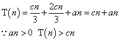

## Chapter 9 中位数和顺序统计量

### 9.1 最大值和最小值  

#### 9.1-1
首先每两个元素比较，构造二叉树，找出最小值向上冒泡，直到最后只有一个元素，即为最小值；然后从根节点开始向下找出除最小值外的第二小值，直到叶结点。这样所用总比较次数为：   
n - 1 + ceil(lgn) -1 = n + ceil(lgn) -2     

#### 9.2-2      
最坏情况下每个数都可能是最大或最小值，首先先比较前两个元素，得到此时最大最小值，接下来每个元素的比较情况为 先和最小值比较，当小于，则只比较这一次，当大于，还要和最大值比较一次，所以：   
每个元素比较次数为 1/2 * 1 + 1/2 * 2 = 3/2    
总比较次数： 3/2 * (n-2) + 1 = 3n/2 - 2         

### 9.2 期望为线性的选择算法          

#### 9.2-1    
p  == r == 0 , 直接返回A[p]

#### 9.2-2
由于每个元素被选中做为主元的事件是相互独立的，均为 1/n ，E[X_k] = 1/n ，T[max(k-1,n-k)]取决于除 X_k 外的其他元素在递归中被选中做为主元的概率，所以相互独立。

#### 9.2-3
[circleSelected](Select.java)

#### 9.2-4
每次恰好选中最大元素即形成最坏情况。

### 9.3 最坏情况为线性时间的选择算法  

#### 9.3-1  
+ 7个仍然是线性的   

+ 当为3个元素时候，得到：      
 那么假设 T(n) <= cn      
         

#### 9.3-2  
由分析得： 当 n >= 140 ,       
至少有 (3n/10)-6 >= 36     
n/4 = 35    

#### 9.3-3        
先用线性时间找中位数，然后用该中位数划分数组即可         

#### 9.3-4
证明：在找到第i小元素x的过程中，算法将小于x的i-1个元素和n-i个大于x的元素分开，因此在这两部分中返回i-1中的最大元素和n-i的最小元素即可。      

#### 9.3-5

    find(A,p,q,i)
    if p == q
      return A[p]
    x = midem(A,p,q)     //发现中位数子程序  
    r = partition(A,p,q,x)  //快速排序划分程序
    if i < r
      find(A,p,r-1,i)
    else if i == r  
      retrun x
    else  
      find(A,r+1,q,i-r)            

时间：T(n) = T(n/2) + O(n)  = O(n)         

#### 9.3-6    
求 k 分位数，即是求 1*(n/k) , 2*(n/k) , ... , (k-1) * (n/k) 的顺序统计量，可以先考虑求中间位置的顺序统计量，由于再求的过程中已经通过PARATITION将数组划分为两边，再分别递归求两边的顺序统计量即可。  
T(n) = 2T(k/2) + O(n) = O(nlgk)        
[kthQuantities](Select.java)           

#### 9.3-7  
[kCloseMedim](Select.java)

#### 9.3-8
[twoArraryMedim](Select.java)

#### 9.3-9
在 y 的中值处即可。  

### 思考题  

#### 9-1  
**a.** 
