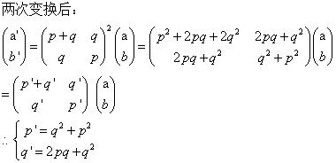

### 1.2 过程与它们所产生的计算

#### 练习

#### 1.9    
**1.**    
(+ 4 5)              
(inc (+ 3 5))     
(inc (inc (+ 2 5)))   
(inc (inc (inc (+ 1 5))))          
(inc (inc (inc (inc (+ 0 5)))))      
(inc (inc (inc (inc 5))))    
(inc (inc (inc 6)))      
(inc (inc 7))          
(inc 8)              
9        
递归的计算过程            

**2.**         
(+ 4 5)  
(+ 3 6)    
(+ 2 7)   
(+ 1 8)  
(+ 0 9)    
9      
迭代的计算过程                

#### 1.10               
表达式|结果   
-|-   
(A 1 10)|2^10=1024     
(A 2 4)|2^2^2^2 = 2^16 =65536         
(A 3 3)|2^2^2^2 = 2^16 =65536        
-|-   
(define (f n) (A 0 n))|2n         
(define (g n) (A 1 n))|2^n    
(define (h n) (A 2 n))|2^2^....^2 (总共有n-1个2连指)       

#### [1.11](111.scm)

#### 1.12
递归版本的计算

    ;n: 行数 x: 第x个数字
    (define (pascal n x)
      (cond ((or (< x 1) (> x n)) 0)
            ((= n 1) 1)
        (else
          (+ (pascal (- n 1) x) (pascal (- n 1) (- x 1)))
        )
      )
    )

#### 1.13   
   

#### 1.14  
图略   
增长步数：O(n^k)    
不妨先假设只有一种1分的，则：     
f(1) = 3  
f(n) = f(n-1) + 1 = f(n-2) + 2 = ... = f(1) + 2(n-1) = O(n)          
现在加入一种5分的，令 d = n/5  则：      
g(n) = f(n) + g(n-5) + 1  
= O(n) + f(n-5) + g(n-10) + 2   
= O(n) + O(n-5) + f(n-10) + g(n-15) + 3   
= ...     
= O(nd) + d  = O(n^2)   
....  
加入k种后： O(n^k)              
空间：O(n)        

#### 1.15
**a)** 5    

**b)**   
空间：O(log(a))   
步数：O(log(a))  
a/(3^x) < 0.1   
3^x > 10a  
x > log3(a)     

#### [1.16](pow.scm)          

#### [1.17](mul.scm)   

#### [1.18](mul.scm)   
**注意：** 在偶数时，对前一个数加倍，对后一个数减半 ，不是对返回值加倍或者在外圈对整个计算加倍。    

#### [1.19](fib.scm)  
**证明.**   
    

#### 1.20   
**正则序：**           
以%：求余、 [a b] : (gcd a b)    
1) if (= 40 0) 206 [40 206%40]           
2) if (= 206%40 0) 40 [206%40 40%(206%40)]       
3) if (= 40%(206%40) 0) 206%40 [40%(206%40) (206%40)%(40%(206%40))]      
4) if (= (206%40)%(40%(206%40)) 0) 40%(206%40) [(206%40)%(40%(206%40)) (40%(206%40))%((206%40)%(40%(206%40)))]    
5) if (= (40%(206%40))%((206%40)%(40%(206%40))) 0) ((206%40)%(40%(206%40))) [...]       
由于第（5）步条件成立，所以开始计算%个数，包括条件处的和结果处的% 以及前几步条件计算处的%，总共18次 。

**应用序：**    
以%：求余 、 [a b] : (gcd a b)   
1) if (= 40 0) 206 [40 206%40]   
2) if (= 6 0) 40 [6 40%6]    
3) if (= 4 0) 6 [4 6%4]  
4) if (= 2 0) 4 [2 4%2]   
5) if (= 0 0) 2 [..]       
总共4次    

#### 1.21         
199 -> 199          
1999 -> 1999             
19999 -> 7         

#### [1.22](prime.scm)   
测试：MIT-Scheme ，Celeron 1007U @ 1.50GHz   

1. 1000以上的：   

数|时间   
-|-     
1009|0
1013 |0
1019|0    

2. 10000以上的    

数|时间   
-|-    
10007|0
10009|0  
10037|0    

3. 100000以上的   

数|时间   
-|-    
100003|1.59999999999e-2     
100019|0
100043|0        

4. 1000000以上的     

数|时间   
-|-     
1000003 | 0  
1000033|0
1000037|0   

5. 10000000以上的

数|时间   
-|-   
10000019|1.5000000000000568e-2    
10000073|0
10000103|1.5000000000000568e-2     

6. 100000000以上的      

数|时间   
-|-  
100000007|4.6999999999997044e-2
100000037|3.0999999999998806e-2
100000039|0.04700000000000415   

7. 10 0000 0000以上的  

数|时间   
-|-  
1000000007|0.14099999999999824  
1000000009|0.14100000000000534   
1000000021|0.14099999999999824  

8. 100 0000 0000以上的  

数|时间   
-|-    
10000000019|0.45299999999999452
10000000033|0.4540000000000006
10000000061|0.4540000000000006  

9. 1000 0000 0000以上的  

数|时间   
-|-   
100000000003|1.4380000000000024
100000000019|1.4519999999999982
100000000057|1.4230000000000018   

可以看出基本上都是√10倍左右 ，实际运算要多一点。    

#### [1.23](prime.scm)

1. 1000 0000 0000以上的  

数|时间   
-|-   
100000000003|0.859
100000000019|0.8600000000000003
100000000057|0.8279999999999994   

2. 100 0000 0000以上的  

数|时间   
-|-    
10000000019|0.2660000000000009
10000000033|0.2809999999999988
10000000061|0.266    

比值大致在1.67 ~ 1.72左右 ，应该是cond判断消耗了时间    

#### 1.24   
