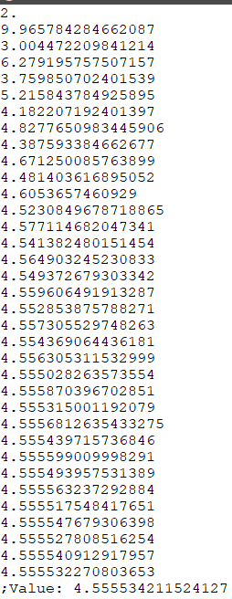
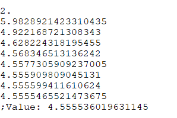

### 1.3 用高阶函数做抽象

#### 练习

#### [1.29 sen-rule](sum.scm)  
考虑∑f(k) , K:第k项

#### [1.30 sumi](sum.scm)  
将函数值加到result上即可   

#### [1.31 factorial](sum.scm)     

#### [1.32](sum.scm)
将 + ， * 的地方替换为combiner即可  

#### [1.33](sum.scm)  
在其中定义一个过滤器过程，对term(a)进行判断  

#### 1.34
(f f)   
-> (f 2)  
-> (2 2)  
无法计算  

##### 函数不动点：
f(x) = x 的解    
无解的话，也可以反复计算(f(f(...f(x))) 直到数值变化不大时的f(x)    

#### 1.35   
**证明：**  
因为黄金分割率是方程 x^2 = x + 1 的解，对该方程变换一下得x = 1 + 1/x   

    (fixed-point (lambda (x) (+ 1 (/ 1.0 x))) 1.0)    

#### [1.36 xx](fixedpoint.scm)  

    (fixed-point (lambda (y) (/ (log x) (log y)) 2.0)

  

    (fixed-point (lambda (y) (/ (+ y (/ (log x) (log y))) 2.0)) 2.0)

      

#### [1.37](confrac.scm)  
**a.**   
在k = 11之后就差不多了  
0.6180555555555556  

**b.**      
