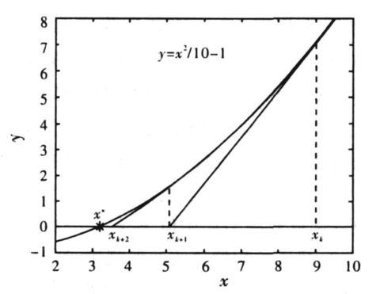

### 1.3 用高阶函数做抽象

#### 练习

#### [1.29 sen-rule](sum.scm)  
考虑∑f(k) , K:第k项

#### [1.30 sumi](sum.scm)  
将函数值加到result上即可   

#### [1.31 factorial](sum.scm)     

#### [1.32](sum.scm)
将 + ， * 的地方替换为combiner即可  

#### [1.33](sum.scm)  
在其中定义一个过滤器过程，对term(a)进行判断  

#### 1.34
(f f)   
-> (f 2)  
-> (2 2)  
无法计算  

##### 函数不动点：
f(x) = x 的解    
无解的话，也可以反复计算(f(f(...f(x))) 直到数值变化不大时的f(x)    

#### 1.35   
**证明：**  
因为黄金分割率是方程 x^2 = x + 1 的解，对该方程变换一下得x = 1 + 1/x   

    (fixed-point (lambda (x) (+ 1 (/ 1.0 x))) 1.0)    

#### [1.36 xx](fixedpoint.scm)  

    (fixed-point (lambda (y) (/ (log x) (log y)) 2.0)

  

    (fixed-point (lambda (y) (/ (+ y (/ (log x) (log y))) 2.0)) 2.0)

      

#### [1.37](confrac.scm)  
**a.**   
在k = 11之后就差不多了  
0.6180555555555556  

**b.**   

    (define (cont-fraci n d k)
      (define (cf n d k res)
        (if (= k 0) res
          (cf n d (- k 1) (/ (n k) (+ (d k) res)))))
      (cf n d k 0))      

#### [1.38 e-value](confrac.scm)  
Di序列可看做每三个数一组，只有第二个数是变化的，假设第二个数处于第x组，那么该数为2x   

#### [1.39 tan-cf](confrac.scm)  

#### 牛顿迭代法  
**使用条件：**   
函数在区间[a,b]上有连续的二阶导函数,其中a,b为区间的2个端点 ,并且满足:f(a)·f(b)<0, 表示在区间[a,b] 上上一定有根,f′(x)·f″(x)≠0, 等价于f′(x)≠0 且f″(x)≠0.     
        

**初值选取：**    
使不等式 f(x0)f″(x0)>0成立的值作为初始值 x0

**参考：**  
柳辉. 解非线性方程的牛顿迭代法及其应用[J]. 重庆理工大学学报, 2007, 21(8):95-98.    

#### 1.40    

    (define (cubic a b c)
      (lambda (x) (+ (* x x x) (* a x x) (* b x) c)))    

#### 1.41   

    (define (double f)
      (lambda (x) (f (f x))))   

    (((double (double double)) inc) 5)  = 21

1 2 4 16 256 ...    

#### 1.42    

    (define (compose f g)
      (lambda (x) (f (g x))))     

#### 1.43   

    (define (repeated f n)
      (define (compose f g)
        (lambda (x) (f (g x))))
	    (if (= n 1) f
		    (compose f (repeated f (- n 1)))))   

#### [1.44 smooth](compose.scm)   

#### [1.45 rootn](fixedpoint.scm)   
次数为logn取下整   

#### [1.46](iterimprove.scm)    
