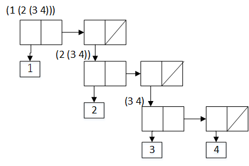
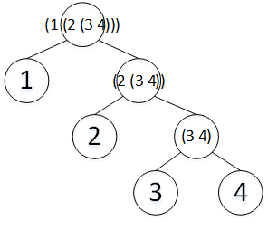

### 2.2 层次性数据和闭包性质

#### 序列的表示

#### [2.17 last-pair1](code/list.scm)  

#### [2.18 reverse1](code/list.scm)  

#### [2.19 change-charge](code/coins.scm)  
顺序改变，不会影响结果  

#### [2.20 same-parity](code/list.scm)  
不会用

#### 对表的映射

#### [2.21 square-list](code/map.scm)

#### 2.22
**相反：**     
在2.21中由于递归存在，过程展开如下：   
()  
(cons nil x1)  
(cons x1 (cons x2))  
....    
(cons x1 (cons x2 (cons x3 (cons ...(cons xn nil)))))     
是逐渐从最后一个数形成一个列表的    
而2.22中过程展开如下：   
()        
(cons x1 nil)  
(cons x2 (x1))  
(cons x3 (x2 x1))  
.....       
(cons xn (xn-1 xn-1 ... x2 x1))         
(xn (xn-1 (xn-2 (...(x1 nil)))))  
最里面的是第一步形成的表，然后逐渐向外部增加元素        

**交换位置：**          
在交换位置后，cons第一项为一个表，而另外一项为一个数字，结合后就是表和数字构成的序列，如下：     
((((() 1) 2) ...) n)      
如果该数字要做为表的最后一个数字，但是这个数字无法嵌入到表的最内层。      

#### [2.23 for-each1](code/map.scm)    

#### 层次性结构      

#### 2.24   
**结果：**       
(1 (2 (3 4)))     

**盒子指针**    
   

**树**   
      

#### 2.25   
式子|代码
-|-
(1 3 (5 7) 9) | (cdr (car (cdr (cdr ls))))
((7)) | (car (car ls))    
(1 (2 (3 (4 (5 (6 (7))))))) | (car (cdr (cdr (cdr (cdr (cdr (cdr ls)))))))     

#### 2.26       
代码|结果   
-|-  
(append x y)|(1 2 3 4 5 6)     
(cons x y) | ((1 2 3) 4 5 6)       
(list x y) | ((1 2 3) (4 5 6))   

#### [2.27 deep-reverse](code/tree.scm)  
关键是画出该二叉表的存储结构，然后考虑，分为四种情况：    
1. 空，什么也不干  
2. 只有一个元素直接返回    
3. 为序对且左右均不为空，就翻转  
4. 右边为空，则翻转左边的内容即可    

#### [2.28 fringex](code/tree.scm)  
与2.27类似，考虑四种情况，注意使用append将递归形成的表合并成一个        

#### [2.29](code/mobile.scm)        
**a.** 注意list存储结构，  

**b.** 用pair?判断是活动体还是具体的重量   

**c.** 类似   

**d.** 改变选择函数里面的内容即可    

#### 对树的映射   

#### [2.30 square-tree](code/tree.scm)    

#### [2.31 tree-map1](code/tree.scm)   

#### [2.32 subsets](code/tree.scm)  
一个集合的子集是除去某一个元素后的子集A与该元素与子集A的每一个元素合并后的集合B的并集，例如：   
(1 2 3)    
除去1后的子集A = (() (2) (3) (2 3))   
1 与 A 合并得 B = ((1) (1 2) (1 3) (1 2 3))  
A∪B = (1 2 3) 的所有子集     
如此递归的减少每一个元素，求剩下元素的子集即可   

#### 序列作为一种约定的界面     
  
