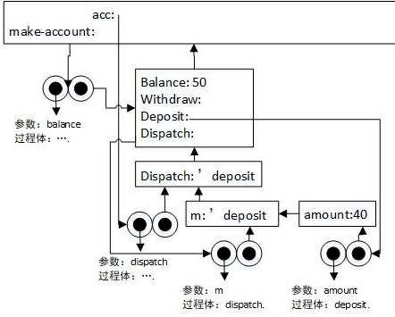

### 3.2 求值的环境模型

#### 3.9
**a.递归版本**       
      
**b.迭代版本**        
    

#### 3.10    
首先定义过程make-withdraw:    
     
执行(define w1 (make-withdraw 100)):  
     
执行(w1 50):       
   
之后：   
     
执行(define w2 (make-withdraw 100))       
        

相同的行为：因为尽管多出一个环境用来initial-amount,但是w1 , w2的balance 等所处环境仍然是局部的，创建的过程对象是相同的，执行结果也相同 。    

#### 3.11     
首先定义过程make-account:     
    
执行:(define acc (make-account 50)):    
       
执行((acc 'deposit) 40)     
  
之后：    
    
执行:((acc 'withdraw) 60)        
        
之后：    
        
执行：(define acc2 (make-account 100))     
        
