### 3.3 用变动数据做模拟

#### 3.12
第一个: (b)        
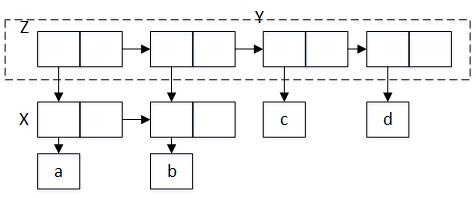             
第二个：(b c d)         
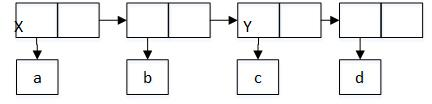

#### 3.13    
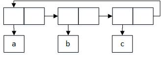           
出错，因为没有结束符号，不是一个序对了   

#### 3.14  
定义时v的结构：        
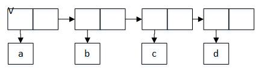        
执行：(define w (mystery v)) 后v , w的结构：     
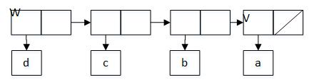            
v : (a)   
w : (d c b a)       

#### 3.15    
作用于Z1时：         
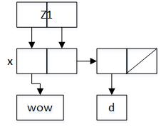             
作用于Z2时：      
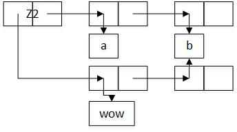            

#### 3.16         
1. 3           
    (define s1 (list 'a 'b 'c))        
    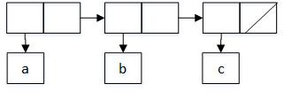       

2. 4       
    (define  m (cons 'a 'b))         
    (define  m1 (cons 'a m))          
    (define s2 (cons m1 m))        
    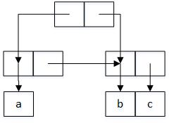        

3. 7    
    (define t (cons 'a 'b))         
    (define t1 (cons t t))     
    (define s3 (cons t1 t1))     
    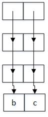        

4.  maxmum depth recursion        
    (define s4 (list 'a 'b 'c))          
    (make-cycle s4)   
               

#### [3.17 count-pairs-true](code/setcons.scm)          
构造一个组装序对的列表，每遇到一个序对就检查是否在该列表中，如果不在则添加进去，并且遍历car、cdr的部分，否则就返回该列表（原因是如果列表中有该序对存在，就代表该路径走过），其长度即为序对的个数        

#### [3.18 is-cycle](code/setcons.scm)     
构造一个组装序对的列表，每遇到一个序对就检查是否在该列表中，如果不在则添加进去，并且遍历car、cdr的部分，否则就代表再次遇到该序对，则存在环。        

#### [3.19 is-cycle2](code/setcons.scm)

#### 3.20   
(define x (cons 1 2))     
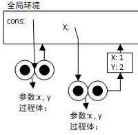    

(define z (cons x x))           
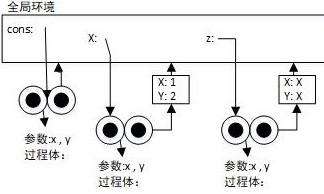        

(set-car! (car z) 17)        
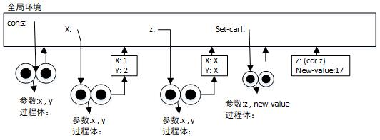    

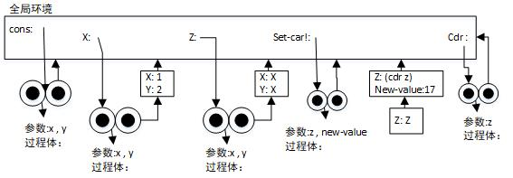      

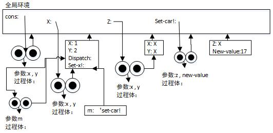     

(car x)          
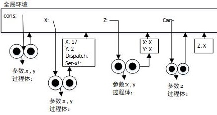

#### 队列的表示    

#### 3.21   
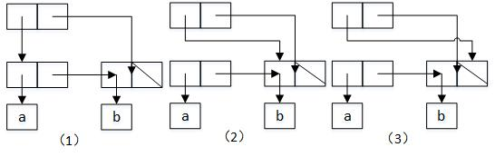       
由上图（1）在插入a , b之后的情况，当删除a后，如(2)所示，头指针指向了第二个元素，在删除b后，如图（3）所示，只是将头指针置为空，并没有改变尾指针的位置，因此在输出时仍然会输出尾元素，其实此时队列已经为空。           

    ; 由图中可看到，头指针所形成的表即是队列中所有的元素
    (define (print-ueu ueu)
      (car ueu))          

#### [3.22 make-qu](code/qu.scm)          

#### [3.23 make-deque](code/qu.scm)
表示方法都一样，只不过头可以添加，尾可以删除    
注意底层实现为包含三个元素的表，一个是存放的值，一个是指向当前表前面的表，另一个是指向当前表后面的表  

#### 表格的表示   

#### [3.24 make-num-table](code/table.scm)   
比较关键码的操作存在于assoc过程中，只要在该过程中将equal?转换为same-key？即可。其他的部分和创建局部过程中代码一致。            

#### [3.25 make-mul-table](code/table.scm)
构造的是一个多级表结构，按照关键码的顺序分层。

#### [3.26](code/treetable.scm)       

#### 3.27
**a.**  
在定义memo-fib时如图：
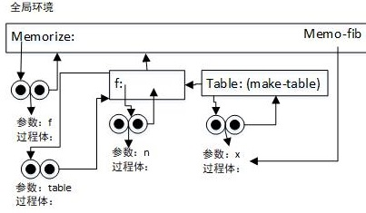     

之后代入数值3，
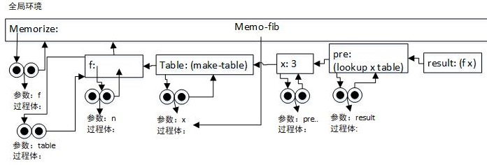    

之后迭代计算 0 1 2   
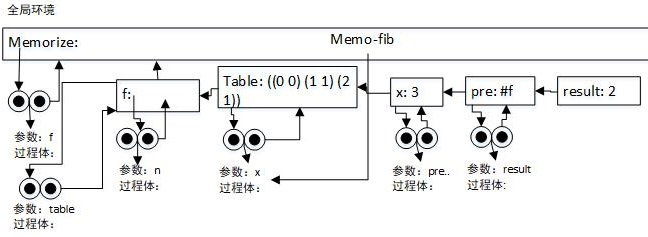   
在计算每一个数时，由于前面计算会存储每一个数的结果在表中  

**b.**    
用(memorize fib) 在计算之前数的结果时，还是会用本来的fib过程，而不会保存下本次结果，所以时间复杂度不变   

#### 数字电路的模拟器     

#### [3.28 or-gate](code/electric.scm)         

#### [3.29 or-gate2](code/electric.scm)
 x ∨ y = ¬(¬x ∧ ¬y)   
 **延迟:**  由于使用了三个非门和一个与门，所以3 * inverter-delay + and-gate-delay       

#### [3.30 ripple-carry-adder](code/electric.scm)    
**延迟:**       
半加器：两个与门，一个或门，一个非门        
全加器：两个半加器，一个或门    
级联：n个全加器    
4n * and + 3n * or + 2n * not           

#### 3.31            
